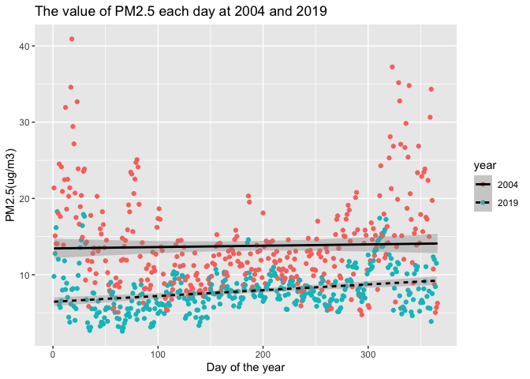

Work1
================
yutian
9/7/2022

# Assignment Description

Work with air pollution data from the U.S. Environmental Protection
Agency (EPA). The EPA has a national monitoring network of air pollution
sites that The primary question you will answer is whether daily
concentrations of PM (particulate matter air pollution with aerodynamic
diameter less than 2.5 m) have decreased in California over the last 15
years (from 2004 to 2019).

``` r
library(data.table)
library(tidyverse)
```

    ## ── Attaching packages ─────────────────────────────────────── tidyverse 1.3.1 ──

    ## ✔ ggplot2 3.3.5     ✔ purrr   0.3.4
    ## ✔ tibble  3.1.6     ✔ dplyr   1.0.8
    ## ✔ tidyr   1.2.0     ✔ stringr 1.4.0
    ## ✔ readr   2.1.2     ✔ forcats 0.5.1

    ## ── Conflicts ────────────────────────────────────────── tidyverse_conflicts() ──
    ## ✖ dplyr::between()   masks data.table::between()
    ## ✖ dplyr::filter()    masks stats::filter()
    ## ✖ dplyr::first()     masks data.table::first()
    ## ✖ dplyr::lag()       masks stats::lag()
    ## ✖ dplyr::last()      masks data.table::last()
    ## ✖ purrr::transpose() masks data.table::transpose()

``` r
library(dplyr)
library(leaflet)
library(lubridate)
```

    ## 
    ## Attaching package: 'lubridate'

    ## The following objects are masked from 'package:data.table':
    ## 
    ##     hour, isoweek, mday, minute, month, quarter, second, wday, week,
    ##     yday, year

    ## The following objects are masked from 'package:base':
    ## 
    ##     date, intersect, setdiff, union

# Step1. Read the data and Check them

-   After downloading 2004 and 2019 data for all sites in California
    from the EPA Air Quality Data website

-   Read in the data using data.table()

``` r
pm2019 <- fread("pm2019.csv")
pm2004 <- fread("pm2004.csv")
```

-   For each of the two datasets, check the dimensions, headers,
    footers, variable names and variable types.

### Check for 2019

``` r
dim(pm2019)
```

    ## [1] 53156    20

``` r
head(pm2019)
```

    ##          Date Source  Site ID POC Daily Mean PM2.5 Concentration    UNITS
    ## 1: 01/01/2019    AQS 60010007   3                            5.7 ug/m3 LC
    ## 2: 01/02/2019    AQS 60010007   3                           11.9 ug/m3 LC
    ## 3: 01/03/2019    AQS 60010007   3                           20.1 ug/m3 LC
    ## 4: 01/04/2019    AQS 60010007   3                           28.8 ug/m3 LC
    ## 5: 01/05/2019    AQS 60010007   3                           11.2 ug/m3 LC
    ## 6: 01/06/2019    AQS 60010007   3                            2.7 ug/m3 LC
    ##    DAILY_AQI_VALUE Site Name DAILY_OBS_COUNT PERCENT_COMPLETE
    ## 1:              24 Livermore               1              100
    ## 2:              50 Livermore               1              100
    ## 3:              68 Livermore               1              100
    ## 4:              86 Livermore               1              100
    ## 5:              47 Livermore               1              100
    ## 6:              11 Livermore               1              100
    ##    AQS_PARAMETER_CODE       AQS_PARAMETER_DESC CBSA_CODE
    ## 1:              88101 PM2.5 - Local Conditions     41860
    ## 2:              88101 PM2.5 - Local Conditions     41860
    ## 3:              88101 PM2.5 - Local Conditions     41860
    ## 4:              88101 PM2.5 - Local Conditions     41860
    ## 5:              88101 PM2.5 - Local Conditions     41860
    ## 6:              88101 PM2.5 - Local Conditions     41860
    ##                            CBSA_NAME STATE_CODE      STATE COUNTY_CODE  COUNTY
    ## 1: San Francisco-Oakland-Hayward, CA          6 California           1 Alameda
    ## 2: San Francisco-Oakland-Hayward, CA          6 California           1 Alameda
    ## 3: San Francisco-Oakland-Hayward, CA          6 California           1 Alameda
    ## 4: San Francisco-Oakland-Hayward, CA          6 California           1 Alameda
    ## 5: San Francisco-Oakland-Hayward, CA          6 California           1 Alameda
    ## 6: San Francisco-Oakland-Hayward, CA          6 California           1 Alameda
    ##    SITE_LATITUDE SITE_LONGITUDE
    ## 1:      37.68753      -121.7842
    ## 2:      37.68753      -121.7842
    ## 3:      37.68753      -121.7842
    ## 4:      37.68753      -121.7842
    ## 5:      37.68753      -121.7842
    ## 6:      37.68753      -121.7842

``` r
tail(pm2019)
```

    ##          Date Source  Site ID POC Daily Mean PM2.5 Concentration    UNITS
    ## 1: 11/11/2019    AQS 61131003   1                           13.5 ug/m3 LC
    ## 2: 11/17/2019    AQS 61131003   1                           18.1 ug/m3 LC
    ## 3: 11/29/2019    AQS 61131003   1                           12.5 ug/m3 LC
    ## 4: 12/17/2019    AQS 61131003   1                           23.8 ug/m3 LC
    ## 5: 12/23/2019    AQS 61131003   1                            1.0 ug/m3 LC
    ## 6: 12/29/2019    AQS 61131003   1                            9.1 ug/m3 LC
    ##    DAILY_AQI_VALUE            Site Name DAILY_OBS_COUNT PERCENT_COMPLETE
    ## 1:              54 Woodland-Gibson Road               1              100
    ## 2:              64 Woodland-Gibson Road               1              100
    ## 3:              52 Woodland-Gibson Road               1              100
    ## 4:              76 Woodland-Gibson Road               1              100
    ## 5:               4 Woodland-Gibson Road               1              100
    ## 6:              38 Woodland-Gibson Road               1              100
    ##    AQS_PARAMETER_CODE       AQS_PARAMETER_DESC CBSA_CODE
    ## 1:              88101 PM2.5 - Local Conditions     40900
    ## 2:              88101 PM2.5 - Local Conditions     40900
    ## 3:              88101 PM2.5 - Local Conditions     40900
    ## 4:              88101 PM2.5 - Local Conditions     40900
    ## 5:              88101 PM2.5 - Local Conditions     40900
    ## 6:              88101 PM2.5 - Local Conditions     40900
    ##                                  CBSA_NAME STATE_CODE      STATE COUNTY_CODE
    ## 1: Sacramento--Roseville--Arden-Arcade, CA          6 California         113
    ## 2: Sacramento--Roseville--Arden-Arcade, CA          6 California         113
    ## 3: Sacramento--Roseville--Arden-Arcade, CA          6 California         113
    ## 4: Sacramento--Roseville--Arden-Arcade, CA          6 California         113
    ## 5: Sacramento--Roseville--Arden-Arcade, CA          6 California         113
    ## 6: Sacramento--Roseville--Arden-Arcade, CA          6 California         113
    ##    COUNTY SITE_LATITUDE SITE_LONGITUDE
    ## 1:   Yolo      38.66121      -121.7327
    ## 2:   Yolo      38.66121      -121.7327
    ## 3:   Yolo      38.66121      -121.7327
    ## 4:   Yolo      38.66121      -121.7327
    ## 5:   Yolo      38.66121      -121.7327
    ## 6:   Yolo      38.66121      -121.7327

``` r
str(pm2019)
```

    ## Classes 'data.table' and 'data.frame':   53156 obs. of  20 variables:
    ##  $ Date                          : chr  "01/01/2019" "01/02/2019" "01/03/2019" "01/04/2019" ...
    ##  $ Source                        : chr  "AQS" "AQS" "AQS" "AQS" ...
    ##  $ Site ID                       : int  60010007 60010007 60010007 60010007 60010007 60010007 60010007 60010007 60010007 60010007 ...
    ##  $ POC                           : int  3 3 3 3 3 3 3 3 3 3 ...
    ##  $ Daily Mean PM2.5 Concentration: num  5.7 11.9 20.1 28.8 11.2 2.7 2.8 7 3.1 7.1 ...
    ##  $ UNITS                         : chr  "ug/m3 LC" "ug/m3 LC" "ug/m3 LC" "ug/m3 LC" ...
    ##  $ DAILY_AQI_VALUE               : int  24 50 68 86 47 11 12 29 13 30 ...
    ##  $ Site Name                     : chr  "Livermore" "Livermore" "Livermore" "Livermore" ...
    ##  $ DAILY_OBS_COUNT               : int  1 1 1 1 1 1 1 1 1 1 ...
    ##  $ PERCENT_COMPLETE              : num  100 100 100 100 100 100 100 100 100 100 ...
    ##  $ AQS_PARAMETER_CODE            : int  88101 88101 88101 88101 88101 88101 88101 88101 88101 88101 ...
    ##  $ AQS_PARAMETER_DESC            : chr  "PM2.5 - Local Conditions" "PM2.5 - Local Conditions" "PM2.5 - Local Conditions" "PM2.5 - Local Conditions" ...
    ##  $ CBSA_CODE                     : int  41860 41860 41860 41860 41860 41860 41860 41860 41860 41860 ...
    ##  $ CBSA_NAME                     : chr  "San Francisco-Oakland-Hayward, CA" "San Francisco-Oakland-Hayward, CA" "San Francisco-Oakland-Hayward, CA" "San Francisco-Oakland-Hayward, CA" ...
    ##  $ STATE_CODE                    : int  6 6 6 6 6 6 6 6 6 6 ...
    ##  $ STATE                         : chr  "California" "California" "California" "California" ...
    ##  $ COUNTY_CODE                   : int  1 1 1 1 1 1 1 1 1 1 ...
    ##  $ COUNTY                        : chr  "Alameda" "Alameda" "Alameda" "Alameda" ...
    ##  $ SITE_LATITUDE                 : num  37.7 37.7 37.7 37.7 37.7 ...
    ##  $ SITE_LONGITUDE                : num  -122 -122 -122 -122 -122 ...
    ##  - attr(*, ".internal.selfref")=<externalptr>

Name data frame with the data at 2019 as “pm2019” In this data frame,
there are 53156 observations and 20 variables,8 of them are charaters
and others are numeric. ### 2004

``` r
dim(pm2004)
```

    ## [1] 19233    20

``` r
head(pm2004)
```

    ##          Date Source  Site ID POC Daily Mean PM2.5 Concentration    UNITS
    ## 1: 01/01/2004    AQS 60010007   1                           11.0 ug/m3 LC
    ## 2: 01/02/2004    AQS 60010007   1                           12.2 ug/m3 LC
    ## 3: 01/03/2004    AQS 60010007   1                           16.5 ug/m3 LC
    ## 4: 01/04/2004    AQS 60010007   1                           19.5 ug/m3 LC
    ## 5: 01/05/2004    AQS 60010007   1                           11.5 ug/m3 LC
    ## 6: 01/06/2004    AQS 60010007   1                           32.5 ug/m3 LC
    ##    DAILY_AQI_VALUE Site Name DAILY_OBS_COUNT PERCENT_COMPLETE
    ## 1:              46 Livermore               1              100
    ## 2:              51 Livermore               1              100
    ## 3:              60 Livermore               1              100
    ## 4:              67 Livermore               1              100
    ## 5:              48 Livermore               1              100
    ## 6:              94 Livermore               1              100
    ##    AQS_PARAMETER_CODE                     AQS_PARAMETER_DESC CBSA_CODE
    ## 1:              88502 Acceptable PM2.5 AQI & Speciation Mass     41860
    ## 2:              88502 Acceptable PM2.5 AQI & Speciation Mass     41860
    ## 3:              88502 Acceptable PM2.5 AQI & Speciation Mass     41860
    ## 4:              88502 Acceptable PM2.5 AQI & Speciation Mass     41860
    ## 5:              88502 Acceptable PM2.5 AQI & Speciation Mass     41860
    ## 6:              88502 Acceptable PM2.5 AQI & Speciation Mass     41860
    ##                            CBSA_NAME STATE_CODE      STATE COUNTY_CODE  COUNTY
    ## 1: San Francisco-Oakland-Hayward, CA          6 California           1 Alameda
    ## 2: San Francisco-Oakland-Hayward, CA          6 California           1 Alameda
    ## 3: San Francisco-Oakland-Hayward, CA          6 California           1 Alameda
    ## 4: San Francisco-Oakland-Hayward, CA          6 California           1 Alameda
    ## 5: San Francisco-Oakland-Hayward, CA          6 California           1 Alameda
    ## 6: San Francisco-Oakland-Hayward, CA          6 California           1 Alameda
    ##    SITE_LATITUDE SITE_LONGITUDE
    ## 1:      37.68753      -121.7842
    ## 2:      37.68753      -121.7842
    ## 3:      37.68753      -121.7842
    ## 4:      37.68753      -121.7842
    ## 5:      37.68753      -121.7842
    ## 6:      37.68753      -121.7842

``` r
tail(pm2004)
```

    ##          Date Source  Site ID POC Daily Mean PM2.5 Concentration    UNITS
    ## 1: 12/14/2004    AQS 61131003   1                             11 ug/m3 LC
    ## 2: 12/17/2004    AQS 61131003   1                             16 ug/m3 LC
    ## 3: 12/20/2004    AQS 61131003   1                             17 ug/m3 LC
    ## 4: 12/23/2004    AQS 61131003   1                              9 ug/m3 LC
    ## 5: 12/26/2004    AQS 61131003   1                             24 ug/m3 LC
    ## 6: 12/29/2004    AQS 61131003   1                              9 ug/m3 LC
    ##    DAILY_AQI_VALUE            Site Name DAILY_OBS_COUNT PERCENT_COMPLETE
    ## 1:              46 Woodland-Gibson Road               1              100
    ## 2:              59 Woodland-Gibson Road               1              100
    ## 3:              61 Woodland-Gibson Road               1              100
    ## 4:              38 Woodland-Gibson Road               1              100
    ## 5:              76 Woodland-Gibson Road               1              100
    ## 6:              38 Woodland-Gibson Road               1              100
    ##    AQS_PARAMETER_CODE       AQS_PARAMETER_DESC CBSA_CODE
    ## 1:              88101 PM2.5 - Local Conditions     40900
    ## 2:              88101 PM2.5 - Local Conditions     40900
    ## 3:              88101 PM2.5 - Local Conditions     40900
    ## 4:              88101 PM2.5 - Local Conditions     40900
    ## 5:              88101 PM2.5 - Local Conditions     40900
    ## 6:              88101 PM2.5 - Local Conditions     40900
    ##                                  CBSA_NAME STATE_CODE      STATE COUNTY_CODE
    ## 1: Sacramento--Roseville--Arden-Arcade, CA          6 California         113
    ## 2: Sacramento--Roseville--Arden-Arcade, CA          6 California         113
    ## 3: Sacramento--Roseville--Arden-Arcade, CA          6 California         113
    ## 4: Sacramento--Roseville--Arden-Arcade, CA          6 California         113
    ## 5: Sacramento--Roseville--Arden-Arcade, CA          6 California         113
    ## 6: Sacramento--Roseville--Arden-Arcade, CA          6 California         113
    ##    COUNTY SITE_LATITUDE SITE_LONGITUDE
    ## 1:   Yolo      38.66121      -121.7327
    ## 2:   Yolo      38.66121      -121.7327
    ## 3:   Yolo      38.66121      -121.7327
    ## 4:   Yolo      38.66121      -121.7327
    ## 5:   Yolo      38.66121      -121.7327
    ## 6:   Yolo      38.66121      -121.7327

``` r
str(pm2004)
```

    ## Classes 'data.table' and 'data.frame':   19233 obs. of  20 variables:
    ##  $ Date                          : chr  "01/01/2004" "01/02/2004" "01/03/2004" "01/04/2004" ...
    ##  $ Source                        : chr  "AQS" "AQS" "AQS" "AQS" ...
    ##  $ Site ID                       : int  60010007 60010007 60010007 60010007 60010007 60010007 60010007 60010007 60010007 60010007 ...
    ##  $ POC                           : int  1 1 1 1 1 1 1 1 1 1 ...
    ##  $ Daily Mean PM2.5 Concentration: num  11 12.2 16.5 19.5 11.5 32.5 14 29.9 21 15.7 ...
    ##  $ UNITS                         : chr  "ug/m3 LC" "ug/m3 LC" "ug/m3 LC" "ug/m3 LC" ...
    ##  $ DAILY_AQI_VALUE               : int  46 51 60 67 48 94 55 88 70 59 ...
    ##  $ Site Name                     : chr  "Livermore" "Livermore" "Livermore" "Livermore" ...
    ##  $ DAILY_OBS_COUNT               : int  1 1 1 1 1 1 1 1 1 1 ...
    ##  $ PERCENT_COMPLETE              : num  100 100 100 100 100 100 100 100 100 100 ...
    ##  $ AQS_PARAMETER_CODE            : int  88502 88502 88502 88502 88502 88502 88101 88502 88502 88101 ...
    ##  $ AQS_PARAMETER_DESC            : chr  "Acceptable PM2.5 AQI & Speciation Mass" "Acceptable PM2.5 AQI & Speciation Mass" "Acceptable PM2.5 AQI & Speciation Mass" "Acceptable PM2.5 AQI & Speciation Mass" ...
    ##  $ CBSA_CODE                     : int  41860 41860 41860 41860 41860 41860 41860 41860 41860 41860 ...
    ##  $ CBSA_NAME                     : chr  "San Francisco-Oakland-Hayward, CA" "San Francisco-Oakland-Hayward, CA" "San Francisco-Oakland-Hayward, CA" "San Francisco-Oakland-Hayward, CA" ...
    ##  $ STATE_CODE                    : int  6 6 6 6 6 6 6 6 6 6 ...
    ##  $ STATE                         : chr  "California" "California" "California" "California" ...
    ##  $ COUNTY_CODE                   : int  1 1 1 1 1 1 1 1 1 1 ...
    ##  $ COUNTY                        : chr  "Alameda" "Alameda" "Alameda" "Alameda" ...
    ##  $ SITE_LATITUDE                 : num  37.7 37.7 37.7 37.7 37.7 ...
    ##  $ SITE_LONGITUDE                : num  -122 -122 -122 -122 -122 ...
    ##  - attr(*, ".internal.selfref")=<externalptr>

Name data frame with the data at 2004 as “pm2004” In this data frame,
there are 19233 observations and 20 variables,8 of them are charaters
and others are numeric.

``` r
colnames(pm2004) == colnames(pm2019)
```

    ##  [1] TRUE TRUE TRUE TRUE TRUE TRUE TRUE TRUE TRUE TRUE TRUE TRUE TRUE TRUE TRUE
    ## [16] TRUE TRUE TRUE TRUE TRUE

``` r
library(janitor)
```

    ## 
    ## Attaching package: 'janitor'

    ## The following objects are masked from 'package:stats':
    ## 
    ##     chisq.test, fisher.test

``` r
compare_df_cols(pm2004, pm2019, return = "mismatch")
```

    ## [1] column_name pm2004      pm2019     
    ## <0 rows> (or 0-length row.names)

Data frame `pm2004` and `pm2019` have same variable names adn same
variable types.

-   Check for any data issues, particularly in the key variable we are
    analyzing.

### Remove negative values

``` r
summary(pm2004)
```

    ##      Date              Source             Site ID              POC        
    ##  Length:19233       Length:19233       Min.   :60010007   Min.   : 1.000  
    ##  Class :character   Class :character   1st Qu.:60370002   1st Qu.: 1.000  
    ##  Mode  :character   Mode  :character   Median :60658001   Median : 1.000  
    ##                                        Mean   :60588026   Mean   : 1.816  
    ##                                        3rd Qu.:60750006   3rd Qu.: 2.000  
    ##                                        Max.   :61131003   Max.   :12.000  
    ##                                                                           
    ##  Daily Mean PM2.5 Concentration    UNITS           DAILY_AQI_VALUE 
    ##  Min.   : -0.10                 Length:19233       Min.   :  0.00  
    ##  1st Qu.:  6.00                 Class :character   1st Qu.: 25.00  
    ##  Median : 10.10                 Mode  :character   Median : 42.00  
    ##  Mean   : 13.13                                    Mean   : 46.33  
    ##  3rd Qu.: 16.30                                    3rd Qu.: 60.00  
    ##  Max.   :251.00                                    Max.   :301.00  
    ##                                                                    
    ##   Site Name         DAILY_OBS_COUNT PERCENT_COMPLETE AQS_PARAMETER_CODE
    ##  Length:19233       Min.   :1       Min.   :100      Min.   :88101     
    ##  Class :character   1st Qu.:1       1st Qu.:100      1st Qu.:88101     
    ##  Mode  :character   Median :1       Median :100      Median :88101     
    ##                     Mean   :1       Mean   :100      Mean   :88268     
    ##                     3rd Qu.:1       3rd Qu.:100      3rd Qu.:88502     
    ##                     Max.   :1       Max.   :100      Max.   :88502     
    ##                                                                        
    ##  AQS_PARAMETER_DESC   CBSA_CODE      CBSA_NAME           STATE_CODE
    ##  Length:19233       Min.   :12540   Length:19233       Min.   :6   
    ##  Class :character   1st Qu.:31080   Class :character   1st Qu.:6   
    ##  Mode  :character   Median :40140   Mode  :character   Median :6   
    ##                     Mean   :35328                      Mean   :6   
    ##                     3rd Qu.:41860                      3rd Qu.:6   
    ##                     Max.   :49700                      Max.   :6   
    ##                     NA's   :1253                                   
    ##     STATE            COUNTY_CODE        COUNTY          SITE_LATITUDE  
    ##  Length:19233       Min.   :  1.00   Length:19233       Min.   :32.63  
    ##  Class :character   1st Qu.: 37.00   Class :character   1st Qu.:34.07  
    ##  Mode  :character   Median : 65.00   Mode  :character   Median :36.48  
    ##                     Mean   : 58.63                      Mean   :36.23  
    ##                     3rd Qu.: 75.00                      3rd Qu.:38.10  
    ##                     Max.   :113.00                      Max.   :41.71  
    ##                                                                        
    ##  SITE_LONGITUDE  
    ##  Min.   :-124.2  
    ##  1st Qu.:-121.6  
    ##  Median :-119.3  
    ##  Mean   :-119.7  
    ##  3rd Qu.:-117.9  
    ##  Max.   :-115.5  
    ## 

``` r
summary(pm2019)
```

    ##      Date              Source             Site ID              POC        
    ##  Length:53156       Length:53156       Min.   :60010007   Min.   : 1.000  
    ##  Class :character   Class :character   1st Qu.:60310004   1st Qu.: 1.000  
    ##  Mode  :character   Mode  :character   Median :60612003   Median : 3.000  
    ##                                        Mean   :60565264   Mean   : 2.573  
    ##                                        3rd Qu.:60771002   3rd Qu.: 3.000  
    ##                                        Max.   :61131003   Max.   :21.000  
    ##                                                                           
    ##  Daily Mean PM2.5 Concentration    UNITS           DAILY_AQI_VALUE 
    ##  Min.   : -2.20                 Length:53156       Min.   :  0.00  
    ##  1st Qu.:  4.00                 Class :character   1st Qu.: 17.00  
    ##  Median :  6.50                 Mode  :character   Median : 27.00  
    ##  Mean   :  7.74                                    Mean   : 30.58  
    ##  3rd Qu.:  9.90                                    3rd Qu.: 41.00  
    ##  Max.   :120.90                                    Max.   :185.00  
    ##                                                                    
    ##   Site Name         DAILY_OBS_COUNT PERCENT_COMPLETE AQS_PARAMETER_CODE
    ##  Length:53156       Min.   :1       Min.   :100      Min.   :88101     
    ##  Class :character   1st Qu.:1       1st Qu.:100      1st Qu.:88101     
    ##  Mode  :character   Median :1       Median :100      Median :88101     
    ##                     Mean   :1       Mean   :100      Mean   :88214     
    ##                     3rd Qu.:1       3rd Qu.:100      3rd Qu.:88502     
    ##                     Max.   :1       Max.   :100      Max.   :88502     
    ##                                                                        
    ##  AQS_PARAMETER_DESC   CBSA_CODE      CBSA_NAME           STATE_CODE
    ##  Length:53156       Min.   :12540   Length:53156       Min.   :6   
    ##  Class :character   1st Qu.:31080   Class :character   1st Qu.:6   
    ##  Mode  :character   Median :40140   Mode  :character   Median :6   
    ##                     Mean   :35839                      Mean   :6   
    ##                     3rd Qu.:41860                      3rd Qu.:6   
    ##                     Max.   :49700                      Max.   :6   
    ##                     NA's   :4181                                   
    ##     STATE            COUNTY_CODE        COUNTY          SITE_LATITUDE  
    ##  Length:53156       Min.   :  1.00   Length:53156       Min.   :32.58  
    ##  Class :character   1st Qu.: 31.00   Class :character   1st Qu.:34.14  
    ##  Mode  :character   Median : 61.00   Mode  :character   Median :36.63  
    ##                     Mean   : 56.38                      Mean   :36.34  
    ##                     3rd Qu.: 77.00                      3rd Qu.:37.97  
    ##                     Max.   :113.00                      Max.   :41.76  
    ##                                                                        
    ##  SITE_LONGITUDE  
    ##  Min.   :-124.2  
    ##  1st Qu.:-121.6  
    ##  Median :-119.8  
    ##  Mean   :-119.8  
    ##  3rd Qu.:-118.1  
    ##  Max.   :-115.5  
    ## 

I found that there are some pf the Daily PM2.5 Concentration values are
negative which is unrealistic, therefore, we should remove them

``` r
pm2004 <- pm2004[`Daily Mean PM2.5 Concentration` > 0]
pm2019 <- pm2019[`Daily Mean PM2.5 Concentration` > 0]
```

``` r
mean(is.na(pm2019))
```

    ## [1] 0.003955193

``` r
mean(is.na(pm2004))
```

    ## [1] 0.003246449

There are not missing values in both data frames.

# Step2. Combine two datasets

-   Use the Date variable to create a new column for year, which will
    serve as an identifier.
-   Change the names of the key variables so that they are easier to
    refer to in your code.

``` r
pm <- rbind(pm2004, pm2019)
pm <- mutate(pm, year = factor(rep(c(2004, 2019), c(nrow(pm2004), nrow(pm2019))))) 
pm <- as_tibble(pm)
pm <- pm %>%
  rename(
    pm25 = `Daily Mean PM2.5 Concentration`,
    AQI = `DAILY_AQI_VALUE`,
    lat = `SITE_LATITUDE`,
    lon = `SITE_LONGITUDE`,
    county = COUNTY
  )
```

``` r
pms <- pm$Date
pm$Date<-format(mdy(pms), "%m-%d-%Y")
pm$Date <-mdy(pm$Date)
```

Since the Date column is been identified as character instead of Date,
we should change the format

# Step3. Create a basic map

Use leaflet() that shows the locations of the sites (make sure to use
different colors for each year). Summarize the spatial distribution of
the monitoring sites.

``` r
sites<- pm %>%
  group_by(`Site Name`,year,lon,lat) %>%
  summarise(avg_25=mean(pm25))
```

    ## `summarise()` has grouped output by 'Site Name', 'year', 'lon'. You can
    ## override using the `.groups` argument.

``` r
pal <- colorFactor(
  palette = 'plasma',
  domain = sites$year
)
leaflet(sites) %>% 
  addProviderTiles('CartoDB.Positron') %>% 
  addCircles(lat = sites$lat, lng = sites$lon, opacity = 1, fillOpacity = 1, radius = 40,color = ~pal(year)) %>%
  addLegend("topright", pal = colorFactor(
    palette = "plasma", domain = sites$year),values = sites$year,opacity = 1)
```

<!-- -->

From this plot, it is obvious that sites were concentrated in the west,
and at 2019, the monitored sites were more spread.

# Step4. Check and Explore the combined dataset

-   Check for any missing or implausible values of PM in the combined
    dataset.

We have already remove the negative values at step1.

``` r
colSums(is.na(pm))
```

    ##               Date             Source            Site ID                POC 
    ##                  0                  0                  0                  0 
    ##               pm25              UNITS                AQI          Site Name 
    ##                  0                  0                  0                  0 
    ##    DAILY_OBS_COUNT   PERCENT_COMPLETE AQS_PARAMETER_CODE AQS_PARAMETER_DESC 
    ##                  0                  0                  0                  0 
    ##          CBSA_CODE          CBSA_NAME         STATE_CODE              STATE 
    ##               5425                  0                  0                  0 
    ##        COUNTY_CODE             county                lat                lon 
    ##                  0                  0                  0                  0 
    ##               year 
    ##                  0

There are some missing values in the column CBSA_CODE, I will just
remove them.

``` r
pmf <- pm %>%
  filter(!is.na(CBSA_CODE))
```

``` r
colSums(is.na(pmf))
```

    ##               Date             Source            Site ID                POC 
    ##                  0                  0                  0                  0 
    ##               pm25              UNITS                AQI          Site Name 
    ##                  0                  0                  0                  0 
    ##    DAILY_OBS_COUNT   PERCENT_COMPLETE AQS_PARAMETER_CODE AQS_PARAMETER_DESC 
    ##                  0                  0                  0                  0 
    ##          CBSA_CODE          CBSA_NAME         STATE_CODE              STATE 
    ##                  0                  0                  0                  0 
    ##        COUNTY_CODE             county                lat                lon 
    ##                  0                  0                  0                  0 
    ##               year 
    ##                  0

-   Explore the proportions of each and provide a summary of any
    temporal patterns you see in these observations.

### Check for countiesat 2004 and 2019

``` r
pm %>%
  filter(year==2004) %>%
  distinct(county) %>%
  nrow
```

    ## [1] 47

``` r
pm %>%
  filter(year==2019) %>%
  distinct(county) %>%
  nrow
```

    ## [1] 51

At 2019, there were more counties monitored Only use the mutual counties

``` r
pm_mc <- pm %>%
  filter(pm$county %in% intersect(pm2004$COUNTY,pm2019$COUNTY))
```

``` r
pm_mc %>%
  distinct(county) %>%
  nrow
```

    ## [1] 47

``` r
pm_mc$yday <- yday(pm_mc$Date)
```

### Check tge temporal patterns

First, calculte the mean value od Daily PM2.5 concentration

``` r
state <- pm_mc %>%
  group_by(yday,year) %>%
  summarise(avg_pm25=mean(pm25))
```

    ## `summarise()` has grouped output by 'yday'. You can override using the
    ## `.groups` argument.

``` r
ggplot(state, aes(x=yday, y=avg_pm25,group=year,colour=year,linetype=year)) +
  geom_point()+
  geom_smooth(method = lm,col="black")+
  xlab("Day of the year")+ ylab("PM2.5(ug/m3)")+
  ggtitle("The value of PM2.5 each day at 2004 and 2019")
```

    ## `geom_smooth()` using formula 'y ~ x'

<!-- -->

From this figure, it can be seen that overall the value of PM2.5 was
slightly increasing during 2019 while it was lower than it was in 2004
each day.

# Step5. Data Visualization

Explore the main question of interest at three different spatial levels.
Create exploratory plots (e.g. boxplots, histograms, line plots) and
summary statistics that best suit each level of data. Be sure to write
up explanations of what you observe in these data.

### State Level

``` r
p <- ggplot(state, aes(year, avg_pm25))
p + geom_boxplot(aes(colour = year)) +ggtitle("General patterns of average daily PM2.5 content at 2004 and 2019") + xlab("Year")+ylab("average daily PM22.5 content")
```

<!-- -->

From this plot, it can be seen that the value of pm25 content in 2004
was generally higher than in 2019.

``` r
summary(pm2004$`Daily Mean PM2.5 Concentration`)
```

    ##    Min. 1st Qu.  Median    Mean 3rd Qu.    Max. 
    ##    0.10    6.00   10.10   13.13   16.30  251.00

``` r
summary(pm2019$`Daily Mean PM2.5 Concentration`)
```

    ##    Min. 1st Qu.  Median    Mean 3rd Qu.    Max. 
    ##   0.100   4.100   6.500   7.797  10.000 120.900

``` r
summary(state$avg_pm25)
```

    ##    Min. 1st Qu.  Median    Mean 3rd Qu.    Max. 
    ##   2.591   7.062   9.323  10.811  13.130  40.904

``` r
pm_mc$month <- month(pm_mc$Date)
```

Below are the summary of PM2.5 Daily value concentration in each month
at 2004 and 2019. From this summary, it can be seen that in 2004, the
median values of PM2.5 daily concentration January, October and December
were larger than others. In 2019, the standard deviation values were
smaller generally compared with them in 2004.

``` r
pm25 <-pm_mc$pm25
```

``` r
pm_mc %>% 
  group_by(year,month) %>%
  summarise_at(c("pm25"),list(avg = ~mean(pm25),median = ~median(pm25),min=~min(pm25),max=~max(pm25),sd = ~sd(pm25))) %>%
  knitr::kable()
```

| year | month |       avg | median | min |   max |        sd |
|:-----|------:|----------:|-------:|----:|------:|----------:|
| 2004 |     1 | 19.418228 |  17.00 | 0.1 |  74.2 | 14.100567 |
| 2004 |     2 | 10.858773 |   8.30 | 0.1 |  48.5 |  8.504673 |
| 2004 |     3 | 14.139640 |   9.80 | 0.1 | 100.4 | 13.550133 |
| 2004 |     4 | 10.932353 |   9.05 | 0.3 |  90.7 |  7.497608 |
| 2004 |     5 |  9.170833 |   8.70 | 0.1 |  30.6 |  4.364545 |
| 2004 |     6 | 11.477947 |   9.70 | 0.6 |  56.3 |  7.581458 |
| 2004 |     7 | 11.691178 |   9.90 | 1.0 | 251.0 | 12.323055 |
| 2004 |     8 | 10.272461 |   9.00 | 0.2 |  82.3 |  6.295010 |
| 2004 |     9 | 10.899877 |   9.80 | 0.8 |  67.4 |  7.114473 |
| 2004 |    10 | 12.857504 |   9.80 | 0.3 |  90.2 | 10.550754 |
| 2004 |    11 | 17.603215 |  14.70 | 0.2 |  68.2 | 12.631729 |
| 2004 |    12 | 16.777595 |  14.00 | 0.1 |  73.7 | 13.563763 |
| 2019 |     1 | 10.001629 |   7.20 | 0.1 |  83.7 |  9.151119 |
| 2019 |     2 |  5.334644 |   4.30 | 0.1 |  45.7 |  4.128418 |
| 2019 |     3 |  5.434003 |   4.70 | 0.1 |  32.5 |  3.612971 |
| 2019 |     4 |  6.635307 |   5.70 | 0.1 |  63.4 |  4.348120 |
| 2019 |     5 |  6.325704 |   5.70 | 0.2 |  30.9 |  3.586689 |
| 2019 |     6 |  7.640556 |   7.10 | 0.1 |  53.0 |  3.889717 |
| 2019 |     7 |  8.909212 |   8.00 | 0.2 |  91.1 |  5.580554 |
| 2019 |     8 |  7.739105 |   7.40 | 0.1 |  26.2 |  3.539630 |
| 2019 |     9 |  6.992442 |   6.30 | 0.1 |  34.1 |  3.692171 |
| 2019 |    10 |  9.185512 |   8.20 | 0.1 | 120.9 |  6.239156 |
| 2019 |    11 | 11.555779 |   9.10 | 0.1 |  97.3 |  8.614109 |
| 2019 |    12 |  7.966064 |   6.40 | 0.1 | 104.5 |  6.417351 |

### County Level

``` r
p <- ggplot(pm_mc, aes(county, pm25))
p + geom_boxplot(aes(colour = year))+ ggtitle("PM2.5 at different counties at 2004 and 2019")+ylab("PM2.5")+xlab("County Name")+ coord_flip()
```

<!-- -->

``` r
pm_mc %>% 
  group_by(county,year) %>%
  summarise_at(c("pm25"),list(avg = ~mean(pm25),median = ~median(pm25),min=~min(pm25),max=~max(pm25),sd = ~sd(pm25))) %>%
  knitr::kable()
```

| county          | year |       avg | median | min |   max |        sd |
|:----------------|:-----|----------:|-------:|----:|------:|----------:|
| Alameda         | 2004 | 11.077729 |   8.70 | 1.4 |  49.6 |  7.825369 |
| Alameda         | 2019 |  7.343601 |   6.50 | 0.4 |  29.3 |  4.127661 |
| Butte           | 2004 | 10.069820 |   7.90 | 0.6 |  69.0 |  8.973620 |
| Butte           | 2019 |  7.010986 |   6.00 | 0.1 |  97.3 |  6.011873 |
| Calaveras       | 2004 |  7.606557 |   7.00 | 1.0 |  24.0 |  4.793324 |
| Calaveras       | 2019 |  5.460947 |   5.20 | 0.7 |  24.8 |  2.686622 |
| Colusa          | 2004 | 10.049254 |   7.00 | 0.6 |  44.6 |  8.897540 |
| Colusa          | 2019 |  6.626309 |   5.80 | 0.2 |  27.5 |  4.202260 |
| Contra Costa    | 2004 | 12.781467 |   8.60 | 2.1 |  73.7 | 10.763384 |
| Contra Costa    | 2019 |  7.196539 |   6.40 | 0.3 |  35.9 |  3.931737 |
| Del Norte       | 2004 |  3.435345 |   2.80 | 0.1 |  10.1 |  2.304410 |
| Del Norte       | 2019 |  4.934952 |   4.10 | 0.2 |  21.7 |  3.489187 |
| El Dorado       | 2004 |  3.519531 |   2.90 | 0.1 |  20.0 |  3.311898 |
| El Dorado       | 2019 |  2.748023 |   2.40 | 0.2 |  22.5 |  2.341136 |
| Fresno          | 2004 | 15.462963 |  11.00 | 0.1 |  71.0 | 12.568990 |
| Fresno          | 2019 |  8.554101 |   7.05 | 0.1 |  51.3 |  6.783424 |
| Humboldt        | 2004 |  8.215517 |   6.20 | 0.4 |  25.6 |  5.632792 |
| Humboldt        | 2019 |  6.787851 |   6.40 | 0.7 |  18.7 |  3.870954 |
| Imperial        | 2004 | 11.034973 |   9.40 | 1.6 |  74.2 |  7.434240 |
| Imperial        | 2019 |  9.570179 |   8.50 | 0.8 |  53.1 |  5.516128 |
| Inyo            | 2004 |  4.575610 |   3.80 | 0.1 |  81.0 |  5.865365 |
| Inyo            | 2019 |  4.722284 |   3.90 | 0.4 |  98.9 |  5.867271 |
| Kern            | 2004 | 17.104064 |  12.30 | 0.1 |  72.8 | 13.628676 |
| Kern            | 2019 |  8.395263 |   7.00 | 0.1 |  83.7 |  7.457966 |
| Kings           | 2004 | 19.654762 |  16.70 | 4.0 |  61.0 | 12.744339 |
| Kings           | 2019 | 12.134410 |   9.40 | 1.0 |  58.8 |  9.364947 |
| Lake            | 2004 |  4.468333 |   3.70 | 1.5 |  18.1 |  2.651478 |
| Lake            | 2019 |  3.194915 |   2.80 | 0.8 |   8.3 |  1.792169 |
| Los Angeles     | 2004 | 17.100134 |  14.70 | 0.1 |  75.6 | 10.689236 |
| Los Angeles     | 2019 | 10.199328 |   9.60 | 0.1 | 120.9 |  5.800731 |
| Marin           | 2004 |  5.773333 |   4.65 | 0.6 |  24.7 |  3.816918 |
| Marin           | 2019 |  5.984683 |   5.20 | 0.6 |  19.5 |  3.209208 |
| Mariposa        | 2004 | 13.295899 |   8.50 | 0.1 | 251.0 | 23.480513 |
| Mariposa        | 2019 |  7.834888 |   5.55 | 0.2 | 104.5 | 10.497487 |
| Mendocino       | 2004 |  6.959016 |   6.20 | 2.6 |  18.5 |  3.319055 |
| Mendocino       | 2019 |  5.710623 |   5.00 | 0.4 |  24.7 |  3.436419 |
| Merced          | 2004 | 17.180000 |  12.50 | 0.8 |  53.1 | 11.497593 |
| Merced          | 2019 |  9.274113 |   7.70 | 1.0 |  41.6 |  5.672229 |
| Mono            | 2004 |  4.152486 |   3.20 | 0.1 |  27.0 |  4.323971 |
| Mono            | 2019 |  5.442697 |   4.00 | 0.2 |  45.7 |  5.834479 |
| Monterey        | 2004 |  6.940000 |   6.10 | 2.8 |  22.3 |  3.414188 |
| Monterey        | 2019 |  4.551795 |   4.00 | 0.1 |  53.0 |  3.038522 |
| Nevada          | 2004 |  6.517241 |   6.00 | 1.0 |  34.0 |  3.957529 |
| Nevada          | 2019 |  5.821673 |   5.60 | 1.0 |  27.1 |  2.670863 |
| Orange          | 2004 | 16.266541 |  13.70 | 2.4 |  58.9 | 10.048865 |
| Orange          | 2019 |  8.963719 |   8.40 | 0.3 |  37.1 |  4.852498 |
| Placer          | 2004 | 13.963008 |  11.30 | 1.0 |  56.4 |  9.260919 |
| Placer          | 2019 |  6.181985 |   5.70 | 0.1 |  44.4 |  3.593602 |
| Plumas          | 2004 | 11.011628 |   8.00 | 1.0 |  45.0 |  8.124749 |
| Plumas          | 2019 |  9.277547 |   5.75 | 1.0 |  50.6 |  7.959888 |
| Riverside       | 2004 | 18.423774 |  14.30 | 0.6 | 100.4 | 14.325320 |
| Riverside       | 2019 |  8.506640 |   7.45 | 0.1 |  58.2 |  5.624985 |
| Sacramento      | 2004 | 13.441942 |  10.00 | 1.0 |  52.5 |  9.858760 |
| Sacramento      | 2019 |  7.124166 |   5.50 | 0.1 |  41.4 |  5.616192 |
| San Benito      | 2004 |  4.245082 |   3.95 | 0.6 |  14.6 |  2.112658 |
| San Benito      | 2019 |  4.530258 |   4.15 | 0.2 |  19.2 |  2.439118 |
| San Bernardino  | 2004 | 14.249496 |  11.00 | 0.2 | 102.1 | 12.712258 |
| San Bernardino  | 2019 |  9.591205 |   8.70 | 0.1 |  91.1 |  6.518342 |
| San Diego       | 2004 | 13.324388 |  11.60 | 0.3 |  67.3 |  7.027799 |
| San Diego       | 2019 |  9.348652 |   8.60 | 0.1 |  36.4 |  5.360378 |
| San Francisco   | 2004 | 10.756607 |   8.50 | 0.9 |  54.9 |  7.476781 |
| San Francisco   | 2019 |  7.667409 |   6.60 | 0.9 |  25.4 |  3.919479 |
| San Joaquin     | 2004 | 13.188525 |  10.00 | 5.0 |  41.0 |  8.803016 |
| San Joaquin     | 2019 |  8.265927 |   6.20 | 1.0 |  50.1 |  6.511605 |
| San Luis Obispo | 2004 |  7.720454 |   6.50 | 2.7 |  30.7 |  4.586369 |
| San Luis Obispo | 2019 |  5.714540 |   5.00 | 0.1 |  26.2 |  3.698691 |
| San Mateo       | 2004 | 10.866949 |   8.95 | 2.7 |  43.2 |  6.911415 |
| San Mateo       | 2019 |  7.008455 |   6.30 | 0.2 |  29.5 |  3.883533 |
| Santa Barbara   | 2004 |  6.868000 |   6.20 | 0.3 |  27.5 |  4.156336 |
| Santa Barbara   | 2019 |  5.227674 |   4.60 | 0.1 |  26.3 |  3.179181 |
| Santa Clara     | 2004 | 11.692121 |   9.10 | 0.8 |  51.5 |  8.809832 |
| Santa Clara     | 2019 |  7.482000 |   6.60 | 0.2 |  34.4 |  4.417643 |
| Santa Cruz      | 2004 |  6.760714 |   6.45 | 1.1 |  22.6 |  3.263555 |
| Santa Cruz      | 2019 |  5.628161 |   5.20 | 0.1 |  21.3 |  2.910707 |
| Shasta          | 2004 |  5.350000 |   3.30 | 0.1 |  70.6 |  7.619987 |
| Shasta          | 2019 |  3.748630 |   2.90 | 0.1 |  24.1 |  3.983141 |
| Siskiyou        | 2004 |  2.648276 |   2.30 | 0.2 |  14.4 |  2.239118 |
| Siskiyou        | 2019 |  5.055022 |   3.25 | 0.2 |  73.9 |  6.828136 |
| Solano          | 2004 | 12.531025 |  10.30 | 2.3 |  49.3 |  8.697984 |
| Solano          | 2019 |  8.714944 |   7.80 | 2.4 |  30.6 |  4.035290 |
| Sonoma          | 2004 |  9.096739 |   7.15 | 2.0 |  26.6 |  6.222583 |
| Sonoma          | 2019 |  5.694737 |   4.95 | 0.2 |  28.0 |  3.290986 |
| Stanislaus      | 2004 | 13.770492 |   9.00 | 3.0 |  53.0 | 11.123275 |
| Stanislaus      | 2019 |  9.140100 |   6.70 | 0.1 |  40.7 |  7.383431 |
| Sutter          | 2004 | 11.699676 |   9.00 | 2.0 |  41.0 |  8.310276 |
| Sutter          | 2019 |  8.266384 |   6.85 | 1.0 |  39.3 |  5.674784 |
| Trinity         | 2004 |  2.886842 |   2.30 | 0.1 |  16.9 |  2.721449 |
| Trinity         | 2019 |  4.944315 |   3.50 | 0.1 |  40.3 |  4.990847 |
| Tulare          | 2004 | 16.644179 |  13.20 | 0.7 |  68.6 | 11.247420 |
| Tulare          | 2019 | 11.190974 |   9.70 | 0.2 |  50.7 |  7.650763 |
| Ventura         | 2004 | 11.197069 |  10.70 | 1.2 |  41.2 |  6.184392 |
| Ventura         | 2019 |  6.686559 |   6.20 | 0.1 |  25.5 |  3.717331 |
| Yolo            | 2004 |  9.662947 |   7.50 | 0.8 |  49.5 |  7.766830 |
| Yolo            | 2019 |  6.849136 |   5.30 | 0.7 |  49.6 |  5.173106 |

It can be seen from this summary that the Daily PM2.5 values varied most
at Mariposa in 2019 and the most enormous Daily PM2.5 was also monitored
at Mariposa in 2004.

### Site Level

#### Remove rows with out site name

``` r
sum(pm$`Site Name` == "")
```

    ## [1] 331

``` r
LAsites <-subset(pm_mc,pm_mc$county=='Los Angeles')
sum(LAsites$`Site Name` == "")
```

    ## [1] 108

``` r
LAsites <-subset(LAsites,LAsites$`Site Name`!='')
sum(LAsites$`Site Name` == "")
```

    ## [1] 0

``` r
LAsites  <- LAsites %>%
  group_by(yday,year,`Site Name`) %>%
  summarise(avg_pm25=mean(pm25))
```

    ## `summarise()` has grouped output by 'yday', 'year'. You can override using the
    ## `.groups` argument.

``` r
length(unique(LAsites$`Site Name`))
```

    ## [1] 15

``` r
ggplot(LAsites, aes(x=yday, y=avg_pm25,color=as.factor(year))) +
  geom_line() +
  labs(title="Temporal patterns of Daily PM2.5 in all sites",
        x ="Day of the year", y = "PM2.5 (ug/m3)",
        color = "Year")+facet_wrap(~`Site Name`,nrow = 5)
```

<!-- --> Here are the
temporal patterns of Daily PM2.5 concentration of each site in Los
Angeles. Compoton, Glendora, Pico Rivera#2, Long Beach-Route 710 Near
Road and Santa Clarita do not have the data at 2004

IN Azusa, Glendora and Pico Rivera#2, the day with the largest PM2.5
concentration happened at around No.200 day and in Reseda, it happened
at about No.300 Day

``` r
pm_mc%>% 
  filter(year == 2004) %>%
  group_by(`Site Name`,year) %>%
  summarise_at(c("pm25"),list(avg = ~mean(pm25),median = ~median(pm25),min=~min(pm25),max=~max(pm25),sd = ~sd(pm25))) %>%
  knitr::kable()
```

| Site Name                                         | year |       avg | median | min |   max |        sd |
|:--------------------------------------------------|:-----|----------:|-------:|----:|------:|----------:|
|                                                   | 2004 | 12.356332 |  10.10 | 0.2 |  60.7 | 10.764888 |
| 3425 N FIRST ST, FRESNO                           | 2004 | 16.812668 |  12.00 | 2.0 |  71.0 | 12.247150 |
| Anaheim                                           | 2004 | 17.384450 |  14.30 | 3.4 |  58.9 | 10.279323 |
| Aqua Tibia Wilderness                             | 2004 |  6.580734 |   6.70 | 0.6 |  13.8 |  3.496333 |
| Atascadero (original site)                        | 2004 |  8.180342 |   6.60 | 2.7 |  30.7 |  5.235509 |
| Azusa                                             | 2004 | 18.405376 |  16.20 | 2.0 |  75.6 | 11.433754 |
| Bakersfield-Airport (Planz)                       | 2004 | 16.466000 |  12.00 | 4.7 |  59.5 | 11.376950 |
| Bakersfield-California                            | 2004 | 20.461647 |  15.60 | 0.1 |  72.8 | 13.877247 |
| Bakersfield-Golden / M St                         | 2004 | 20.722727 |  16.85 | 4.6 |  66.6 | 13.471372 |
| Big Bear                                          | 2004 |  9.532692 |   8.45 | 1.3 |  28.6 |  5.814037 |
| Bliss SP                                          | 2004 |  3.004202 |   2.60 | 0.1 |  16.4 |  2.261633 |
| Brawley-220 Main Street                           | 2004 |  8.943434 |   7.80 | 2.2 |  42.3 |  5.202691 |
| Burbank                                           | 2004 | 19.231193 |  16.00 | 4.0 |  60.1 | 10.528785 |
| Calexico-Ethel Street                             | 2004 | 13.215432 |  11.20 | 2.3 |  48.5 |  7.699412 |
| Chico-Manzanita Ave.                              | 2004 | 14.696721 |  10.00 | 1.0 |  69.0 | 13.746158 |
| Chula Vista                                       | 2004 | 12.154867 |  10.70 | 3.8 |  32.7 |  5.912079 |
| Clovis-Villa                                      | 2004 | 18.656667 |  14.55 | 3.5 |  62.5 | 12.648072 |
| Colusa-Sunrise Blvd                               | 2004 | 10.049254 |   7.00 | 0.6 |  44.6 |  8.897540 |
| Concord                                           | 2004 | 12.781467 |   8.60 | 2.1 |  73.7 | 10.763384 |
| Corcoran-Patterson                                | 2004 | 19.654762 |  16.70 | 4.0 |  61.0 | 12.744339 |
| Davis-UCD Campus                                  | 2004 |  9.456546 |   7.30 | 0.8 |  49.5 |  7.915465 |
| Death Valley NP - Park Village                    | 2004 |  3.946219 |   3.30 | 0.1 |  16.4 |  2.881525 |
| El Cajon                                          | 2004 | 13.547032 |  12.00 | 1.7 |  44.4 |  6.766618 |
| El Centro-9th Street                              | 2004 |  9.642857 |   8.60 | 1.6 |  74.2 |  7.947615 |
| El Rio-Rio Mesa School #2                         | 2004 | 11.324786 |  10.90 | 2.2 |  28.5 |  5.627226 |
| Escondido                                         | 2004 | 14.120631 |  12.10 | 2.0 |  67.3 |  7.696527 |
| Eureka I Street                                   | 2004 |  8.215517 |   6.20 | 0.4 |  25.6 |  5.632792 |
| Fontana                                           | 2004 | 21.961809 |  19.50 | 2.1 | 102.1 | 14.485058 |
| Fremont - Chapel Way                              | 2004 | 10.053192 |   7.95 | 2.8 |  39.9 |  7.024132 |
| Fresno-Pacific                                    | 2004 | 19.410000 |  14.40 | 3.8 |  66.1 | 13.019113 |
| Grass Valley-Litton Building                      | 2004 |  4.821429 |   4.50 | 1.0 |  17.0 |  3.104877 |
| Hoover Wilderness                                 | 2004 |  2.709836 |   1.90 | 0.1 |  20.0 |  2.908449 |
| Indio                                             | 2004 | 10.402484 |   9.80 | 2.3 |  28.5 |  4.794853 |
| Joshua Tree NP - Black Rock                       | 2004 |  4.678512 |   4.50 | 0.4 |  14.7 |  2.953986 |
| Kaiser Wilderness                                 | 2004 |  3.115596 |   2.80 | 0.1 |   9.4 |  2.355536 |
| Kearny Mesa                                       | 2004 | 10.921296 |   9.90 | 0.9 |  28.5 |  5.557214 |
| Keeler                                            | 2004 |  5.165354 |   4.00 | 1.0 |  81.0 |  7.641536 |
| La Posta Reservation                              | 2004 |  4.482609 |   4.20 | 0.3 |   7.3 |  2.303881 |
| Lakeport-Lakeport Blvd.                           | 2004 |  4.468333 |   3.70 | 1.5 |  18.1 |  2.651478 |
| Lancaster-Division Street                         | 2004 |  8.504504 |   9.00 | 1.0 |  18.0 |  3.692434 |
| Lassen Volcanic NP - Manzanita Lake Fire Station  | 2004 |  2.659813 |   2.10 | 0.1 |   8.7 |  1.958718 |
| Lava Beds National Monument                       | 2004 |  2.648276 |   2.30 | 0.2 |  14.4 |  2.239118 |
| Lebec                                             | 2004 |  4.138261 |   3.70 | 0.1 |  12.8 |  2.706962 |
| Lebec-Peace Valley Road                           | 2004 |  4.708411 |   5.00 | 0.1 |  12.4 |  3.111122 |
| Livermore                                         | 2004 | 11.342308 |   9.05 | 1.4 |  49.6 |  8.006954 |
| Long Beach (North)                                | 2004 | 17.634462 |  14.80 | 3.6 |  66.6 |  9.842559 |
| Long Beach (South)                                | 2004 | 16.603670 |  14.50 | 3.3 |  59.7 |  8.809806 |
| Los Angeles-North Main Street                     | 2004 | 20.050841 |  16.80 | 2.0 |  75.0 | 11.316657 |
| Lynwood                                           | 2004 | 18.540870 |  15.70 | 3.6 |  55.8 | 10.399755 |
| Mammoth                                           | 2004 |  7.135593 |   6.00 | 2.0 |  27.0 |  5.191032 |
| Merced-M St                                       | 2004 | 17.180000 |  12.50 | 0.8 |  53.1 | 11.497593 |
| Mission Viejo                                     | 2004 | 12.056757 |  10.50 | 2.4 |  49.4 |  7.842560 |
| Modesto-14th Street                               | 2004 | 13.770492 |   9.00 | 3.0 |  53.0 | 11.123275 |
| Mojave                                            | 2004 |  5.876190 |   5.70 | 0.2 |  17.8 |  3.201447 |
| Ontario Fire Station                              | 2004 | 20.859821 |  16.10 | 4.0 |  86.1 | 13.745220 |
| Palm Springs                                      | 2004 |  8.974107 |   8.50 | 1.7 |  27.1 |  4.894431 |
| Pasadena                                          | 2004 | 16.631858 |  14.10 | 3.6 |  59.4 |  9.600254 |
| Pinnacles NP - Southwest of East Entrance Station | 2004 |  4.245082 |   3.95 | 0.6 |  14.6 |  2.112658 |
| Piru - Pacific                                    | 2004 | 10.090090 |  10.20 | 1.2 |  28.1 |  5.494426 |
| Point Reyes NS Ranger Station                     | 2004 |  5.773333 |   4.65 | 0.6 |  24.7 |  3.816918 |
| Portola-161 Nevada Street                         | 2004 | 12.082873 |   8.00 | 1.0 |  45.0 |  8.854929 |
| Quincy-N Church Street                            | 2004 |  8.493507 |   7.00 | 1.0 |  30.0 |  5.325271 |
| Redding - Buckeye                                 | 2004 | 33.583333 |  29.15 | 8.1 |  70.6 | 22.484965 |
| Redding - Health Department                       | 2004 |  7.258621 |   6.00 | 1.0 |  26.0 |  4.897405 |
| Redding - Toyon                                   | 2004 |  6.457143 |   4.50 | 1.0 |  16.5 |  5.755246 |
| Redwood City                                      | 2004 | 10.866949 |   8.95 | 2.7 |  43.2 |  6.911415 |
| Redwood NP                                        | 2004 |  3.435345 |   2.80 | 0.1 |  10.1 |  2.304410 |
| Reseda                                            | 2004 | 15.574528 |  13.35 | 2.0 |  56.2 |  9.721190 |
| Ridgecrest-California Ave                         | 2004 |  5.907292 |   5.80 | 0.2 |  15.2 |  3.346459 |
| Riverside (Magnolia)                              | 2004 | 20.793636 |  16.35 | 4.0 |  93.8 | 14.367204 |
| Roseville-N Sunrise Ave                           | 2004 | 13.963008 |  11.30 | 1.0 |  56.4 |  9.260919 |
| Rubidoux                                          | 2004 | 23.177637 |  18.90 | 2.4 | 100.4 | 15.206420 |
| Sacramento Health Department-Stockton Blvd.       | 2004 | 12.755365 |   9.00 | 1.0 |  47.0 |  9.655947 |
| Sacramento-1309 T Street                          | 2004 | 13.388710 |  10.10 | 1.0 |  52.5 |  9.372980 |
| Sacramento-Del Paso Manor                         | 2004 | 13.933172 |   9.00 | 1.0 |  51.0 | 10.845993 |
| Salinas 3                                         | 2004 |  6.940000 |   6.10 | 2.8 |  22.3 |  3.414188 |
| San Andreas-Gold Strike Road                      | 2004 |  7.606557 |   7.00 | 1.0 |  24.0 |  4.793324 |
| San Bernardino                                    | 2004 | 22.007547 |  17.15 | 3.2 |  93.4 | 16.021793 |
| San Diego-12th Ave                                | 2004 | 13.827300 |  11.90 | 3.2 |  42.9 |  6.898945 |
| San Francisco                                     | 2004 | 10.857851 |   8.90 | 0.9 |  54.9 |  7.271906 |
| San Francisco - Bayview Hunters Point             | 2004 | 10.570051 |   7.90 | 2.3 |  50.6 |  7.855842 |
| San Jose                                          | 2004 | 12.211268 |   9.30 | 2.3 |  44.9 |  9.066919 |
| San Jose - Jackson                                | 2004 | 11.444743 |   9.10 | 0.8 |  51.5 |  8.684038 |
| San Luis Obispo-Marsh St.                         | 2004 |  6.808475 |   6.40 | 2.7 |  19.4 |  2.715364 |
| San Rafael Wilderness                             | 2004 |  4.476786 |   4.45 | 0.3 |   9.7 |  2.251525 |
| Santa Barbara                                     | 2004 | 10.976364 |  10.80 | 1.4 |  27.5 |  4.861830 |
| Santa Cruz                                        | 2004 |  6.760714 |   6.45 | 1.1 |  22.6 |  3.263555 |
| Santa Maria                                       | 2004 |  7.589655 |   7.80 | 2.7 |  16.6 |  2.751630 |
| Santa Rosa - 5th St                               | 2004 |  9.096739 |   7.15 | 2.0 |  26.6 |  6.222583 |
| Sequoia NP-Ash Mountain                           | 2004 |  8.007143 |   8.05 | 0.7 |  39.7 |  5.399078 |
| Simi Valley-Cochran Street                        | 2004 | 12.256977 |  11.65 | 1.6 |  41.2 |  7.020580 |
| South Lake Tahoe-Sandy Way                        | 2004 | 10.333333 |   9.00 | 1.0 |  20.0 |  6.519202 |
| Stockton-Hazelton                                 | 2004 | 13.188525 |  10.00 | 5.0 |  41.0 |  8.803016 |
| Thousand Oaks                                     | 2004 | 10.783889 |  10.20 | 1.4 |  38.3 |  5.961067 |
| TRAFFIC, RURAL PAVED ROAD                         | 2004 |  8.316770 |   7.25 | 0.6 |  30.8 |  5.355816 |
| Trinity                                           | 2004 |  2.886842 |   2.30 | 0.1 |  16.9 |  2.721449 |
| Truckee-Fire Station                              | 2004 |  7.056818 |   6.00 | 1.0 |  34.0 |  4.053522 |
| Ukiah-Library                                     | 2004 |  6.959016 |   6.20 | 2.6 |  18.5 |  3.319055 |
| Vallejo                                           | 2004 | 12.531025 |  10.30 | 2.3 |  49.3 |  8.697984 |
| Victorville-Park Avenue                           | 2004 | 10.703297 |  10.00 | 2.0 |  34.0 |  4.515154 |
| Visalia-Church                                    | 2004 | 18.522524 |  15.00 | 2.3 |  68.6 | 11.313029 |
| Woodland-Gibson Road                              | 2004 | 10.301724 |   8.00 | 3.0 |  36.0 |  7.283358 |
| Yosemite NP - Turtleback Dome                     | 2004 |  4.012149 |   3.50 | 0.1 |  22.6 |  3.489653 |
| Yosemite NP-Yosemite Village Vistor Center        | 2004 | 18.026190 |  10.45 | 1.7 | 251.0 | 27.582834 |
| Yuba City                                         | 2004 | 11.699676 |   9.00 | 2.0 |  41.0 |  8.310276 |

``` r
pm_mc%>% 
  filter(year == 2019) %>%
  group_by(`Site Name`,year) %>%
  summarise_at(c("pm25"),list(avg = ~mean(pm25),median = ~median(pm25),min=~min(pm25),max=~max(pm25),sd = ~sd(pm25))) %>%
  knitr::kable()
```

| Site Name                                         | year |       avg | median | min |   max |        sd |
|:--------------------------------------------------|:-----|----------:|-------:|----:|------:|----------:|
|                                                   | 2019 |  3.115686 |   2.95 | 0.2 |  12.9 |  2.074587 |
| 29 Palms                                          | 2019 |  7.219667 |   6.70 | 2.0 |  15.4 |  2.571333 |
| Alpine                                            | 2019 |  5.240286 |   4.80 | 0.3 |  13.5 |  3.023112 |
| Anaheim                                           | 2019 |  9.214378 |   8.60 | 0.3 |  37.1 |  4.948970 |
| Aqua Tibia Wilderness                             | 2019 |  3.839535 |   3.80 | 0.5 |   8.7 |  2.005714 |
| Arroyo Grande CDF                                 | 2019 |  6.323907 |   5.00 | 0.1 |  26.2 |  4.845799 |
| Atascadero                                        | 2019 |  4.233146 |   3.80 | 0.1 |  17.3 |  2.634275 |
| Auburn-Atwood                                     | 2019 |  7.184659 |   6.80 | 0.5 |  21.1 |  3.056653 |
| Azusa                                             | 2019 |  9.686777 |   9.00 | 1.4 |  70.3 |  7.502988 |
| Bakersfield-Airport (Planz)                       | 2019 | 12.903478 |  10.70 | 2.2 |  83.7 | 10.450232 |
| Bakersfield-California                            | 2019 | 11.612166 |   9.45 | 1.0 |  59.1 |  8.711404 |
| Bakersfield-Golden / M St                         | 2019 | 12.311570 |  10.00 | 2.3 |  66.1 |  9.563927 |
| Banning Airport                                   | 2019 |  9.474247 |   8.70 | 1.2 |  23.4 |  3.864113 |
| Berkeley- Aquatic Park                            | 2019 |  9.388636 |   8.50 | 2.7 |  28.8 |  3.919879 |
| Big Bear                                          | 2019 |  5.756522 |   4.20 | 0.4 |  31.0 |  5.741918 |
| Bliss SP                                          | 2019 |  2.131147 |   1.60 | 0.2 |   7.6 |  1.601826 |
| Brawley-220 Main Street                           | 2019 |  8.370086 |   7.70 | 2.1 |  28.9 |  4.251314 |
| Calexico-Ethel Street                             | 2019 |  9.996636 |   8.80 | 1.0 |  53.1 |  5.821758 |
| Camp Pendleton                                    | 2019 |  6.412996 |   6.50 | 0.1 |  13.8 |  3.221437 |
| Carmel Valley                                     | 2019 |  3.700845 |   3.50 | 0.1 |  11.1 |  1.941205 |
| Chico-East Avenue                                 | 2019 |  6.664428 |   5.40 | 0.1 |  35.8 |  5.142791 |
| Chula Vista                                       | 2019 |  8.202586 |   8.30 | 2.3 |  18.6 |  3.634842 |
| Clovis-Villa                                      | 2019 |  9.787410 |   8.40 | 2.1 |  39.1 |  6.226613 |
| Colfax-City Hall                                  | 2019 |  5.548630 |   5.30 | 0.2 |  19.5 |  2.710619 |
| Colusa-Sunrise Blvd                               | 2019 |  6.947630 |   5.95 | 0.7 |  27.5 |  4.866384 |
| Compton                                           | 2019 | 11.026073 |  10.50 | 1.9 |  39.5 |  5.386691 |
| Concord                                           | 2019 |  6.744542 |   6.20 | 0.3 |  28.2 |  3.918411 |
| Corcoran-Patterson                                | 2019 | 12.105483 |   9.30 | 1.0 |  58.8 |  9.451398 |
| Cortina Indian Rancheria                          | 2019 |  6.180263 |   5.70 | 0.2 |  17.7 |  3.000947 |
| Crescent City-Crescent Elk School                 | 2019 |  6.262051 |   5.40 | 1.2 |  21.7 |  3.559523 |
| Crestline                                         | 2019 |  8.188372 |   8.05 | 0.8 |  21.2 |  3.498368 |
| Davis-UCD Campus                                  | 2019 |  6.718750 |   5.30 | 0.7 |  49.6 |  5.032577 |
| Donovan                                           | 2019 | 12.801529 |  12.60 | 2.6 |  34.3 |  5.632315 |
| El Cajon - Lexington Elementary School            | 2019 |  9.501648 |   9.50 | 1.6 |  23.8 |  3.740869 |
| El Centro-9th Street                              | 2019 |  7.938793 |   7.50 | 0.8 |  21.4 |  3.844992 |
| El Rio-Rio Mesa School #2                         | 2019 |  6.585714 |   6.30 | 0.5 |  25.5 |  3.430027 |
| Folsom-Natoma St.                                 | 2019 |  6.243577 |   5.50 | 0.2 |  25.4 |  3.897175 |
| Fontana                                           | 2019 | 11.553714 |  10.90 | 0.1 |  81.3 |  8.098395 |
| Fresno - Garland                                  | 2019 | 10.901878 |   8.70 | 1.0 |  51.3 |  7.950149 |
| Fresno-Pacific                                    | 2019 | 11.244737 |   9.35 | 2.3 |  44.7 |  8.180011 |
| Gilroy                                            | 2019 |  5.821944 |   5.00 | 0.3 |  21.3 |  3.156175 |
| Glendora                                          | 2019 | 11.882222 |  10.80 | 3.3 |  75.1 |  6.095701 |
| Goleta                                            | 2019 |  5.069188 |   4.40 | 0.1 |  26.3 |  2.961514 |
| Grass Valley-Litton Building                      | 2019 |  5.956280 |   5.75 | 1.0 |  16.8 |  2.320901 |
| Hanford-Irwin                                     | 2019 | 12.172206 |   9.50 | 1.5 |  48.2 |  9.264172 |
| Hollister                                         | 2019 |  4.918258 |   4.70 | 0.2 |  19.2 |  2.533022 |
| Hoover Wilderness                                 | 2019 |  2.192079 |   1.60 | 0.2 |  10.0 |  1.706674 |
| Huron                                             | 2019 |  5.809429 |   5.40 | 0.2 |  25.3 |  3.998144 |
| Indio                                             | 2019 |  7.369491 |   7.05 | 1.3 |  15.0 |  2.832338 |
| Jacobs                                            | 2019 |  6.787851 |   6.40 | 0.7 |  18.7 |  3.870954 |
| Joshua Tree NP - Black Rock                       | 2019 |  3.186111 |   2.85 | 0.6 |   9.1 |  1.676192 |
| Joshua Tree NP - Cottonwood Visitor Center        | 2019 |  5.182182 |   4.70 | 0.7 |  21.6 |  2.659306 |
| Kaiser Wilderness                                 | 2019 |  2.791667 |   2.00 | 0.1 |  10.2 |  2.320817 |
| Kearny Villa Rd.                                  | 2019 |  6.811494 |   6.35 | 1.7 |  16.2 |  3.377927 |
| Keeler                                            | 2019 |  4.980658 |   4.00 | 0.4 |  63.4 |  5.250559 |
| King City 2                                       | 2019 |  5.523611 |   5.20 | 0.5 |  20.7 |  2.956043 |
| Lake Elsinore                                     | 2019 |  5.003822 |   4.75 | 0.1 |  17.6 |  3.403248 |
| Lake Tahoe Community College                      | 2019 |  3.072414 |   2.90 | 0.3 |  22.5 |  2.596439 |
| Lakeport-S. Main Street                           | 2019 |  3.194915 |   2.80 | 0.8 |   8.3 |  1.792169 |
| Lancaster-Division Street                         | 2019 |  6.205337 |   6.40 | 0.1 |  13.6 |  2.897080 |
| Laney College                                     | 2019 |  7.411944 |   6.40 | 0.8 |  28.5 |  4.073967 |
| Lassen Volcanic NP - Manzanita Lake Fire Station  | 2019 |  2.107527 |   1.80 | 0.1 |   7.2 |  1.475469 |
| Lava Beds National Monument                       | 2019 |  2.297000 |   1.45 | 0.2 |  29.1 |  3.370683 |
| Lebec                                             | 2019 |  4.679063 |   4.30 | 0.1 |  24.5 |  2.896226 |
| Lebec-Peace Valley/Frazier Park Roads             | 2019 |  4.324324 |   4.10 | 0.4 |  14.3 |  2.845066 |
| Lee Vining                                        | 2019 |  3.193805 |   2.60 | 0.2 |  31.0 |  2.699900 |
| Lincoln-2885 Moore Road                           | 2019 |  6.706579 |   6.30 | 1.0 |  17.7 |  3.156337 |
| Livermore                                         | 2019 |  6.367989 |   5.60 | 0.4 |  28.8 |  3.968165 |
| Lompoc H Street                                   | 2019 |  4.848083 |   4.10 | 0.1 |  23.4 |  3.400238 |
| Long Beach (North)                                | 2019 |  9.018239 |   8.50 | 2.0 |  28.0 |  4.453470 |
| Long Beach (South)                                | 2019 |  9.940642 |   9.50 | 1.1 |  31.2 |  4.939569 |
| Long Beach-Route 710 Near Road                    | 2019 | 12.105626 |  11.40 | 1.7 |  45.4 |  5.667458 |
| Los Angeles-North Main Street                     | 2019 | 11.661814 |  10.80 | 1.9 |  43.5 |  5.386573 |
| Mammoth                                           | 2019 |  7.866444 |   5.40 | 1.0 |  45.7 |  7.012906 |
| Manteca                                           | 2019 |  8.604105 |   6.70 | 1.7 |  40.1 |  5.917240 |
| Merced-Coffee                                     | 2019 |  9.180780 |   7.70 | 2.2 |  35.5 |  5.107366 |
| Merced-M St                                       | 2019 |  9.553333 |   7.60 | 1.0 |  41.6 |  7.117430 |
| Mesa2                                             | 2019 |  7.004432 |   6.30 | 1.9 |  23.6 |  3.670018 |
| Mira Loma (Van Buren)                             | 2019 | 12.425835 |  11.70 | 1.3 |  58.2 |  6.954496 |
| Mission Viejo                                     | 2019 |  7.204546 |   6.70 | 1.7 |  20.8 |  3.675093 |
| Modesto-14th Street                               | 2019 |  7.933790 |   5.75 | 0.1 |  36.4 |  6.769348 |
| Mojave                                            | 2019 |  6.522740 |   6.10 | 0.5 |  19.8 |  3.429238 |
| Morongo Air Monitoring Station                    | 2019 |  7.214910 |   6.30 | 0.1 |  25.4 |  5.162732 |
| Oakland                                           | 2019 |  6.777222 |   5.70 | 0.9 |  24.7 |  3.949032 |
| Oakland West                                      | 2019 |  7.792697 |   7.00 | 0.9 |  29.3 |  4.158237 |
| Ojai - East Ojai Ave                              | 2019 |  4.713573 |   4.60 | 0.2 |  13.5 |  2.319988 |
| Ontario-Route 60 Near Road                        | 2019 | 14.171690 |  13.45 | 1.6 |  71.2 |  6.847186 |
| Pala Airpad                                       | 2019 | 13.752975 |  13.30 | 3.3 |  36.4 |  6.295516 |
| Palm Springs                                      | 2019 |  6.073109 |   5.80 | 1.0 |  15.5 |  2.881699 |
| Paradise - Theater                                | 2019 |  3.534821 |   3.00 | 0.2 |  13.9 |  2.213407 |
| Pasadena                                          | 2019 |  8.990286 |   8.50 | 1.3 |  41.8 |  5.438176 |
| Pechanga                                          | 2019 |  4.691123 |   4.50 | 0.2 |  11.5 |  2.417069 |
| Pico Rivera #2                                    | 2019 | 10.387079 |   9.70 | 0.1 |  50.2 |  5.500899 |
| Pinnacles NP - Southwest of East Entrance Station | 2019 |  3.274545 |   2.90 | 0.6 |   7.9 |  1.549278 |
| Piru - Pacific                                    | 2019 |  6.424484 |   6.40 | 0.1 |  19.7 |  3.836575 |
| Pleasanton - Owens Ct                             | 2019 |  6.332102 |   5.70 | 0.7 |  29.1 |  3.898896 |
| Point Reyes NS Ranger Station                     | 2019 |  4.642308 |   4.00 | 0.8 |  16.0 |  2.963457 |
| Porterville                                       | 2019 | 11.004438 |   9.70 | 0.2 |  50.7 |  7.194521 |
| Portola                                           | 2019 | 11.856281 |   7.00 | 1.0 |  50.6 | 10.275648 |
| Quincy-N Church Street                            | 2019 |  7.727190 |   5.50 | 1.0 |  32.7 |  5.638562 |
| Redding - Health Department                       | 2019 |  6.628302 |   5.00 | 1.0 |  24.1 |  5.207664 |
| Redwood City                                      | 2019 |  7.008455 |   6.30 | 0.2 |  29.5 |  3.883533 |
| Redwood NP                                        | 2019 |  2.664912 |   2.15 | 0.2 |  11.4 |  1.786923 |
| Reseda                                            | 2019 | 11.206875 |  10.90 | 0.8 | 120.9 |  7.054356 |
| Ridgecrest-Ward                                   | 2019 |  4.224000 |   3.40 | 0.1 |  34.1 |  3.330152 |
| Roseville-N Sunrise Ave                           | 2019 |  6.591455 |   5.90 | 0.9 |  28.5 |  3.901388 |
| Rubidoux                                          | 2019 | 11.056971 |  10.50 | 0.3 |  57.6 |  6.408394 |
| Sacramento-1309 T Street                          | 2019 |  7.444280 |   5.40 | 0.2 |  37.1 |  5.970500 |
| Sacramento-Bercut Drive                           | 2019 |  8.385965 |   6.20 | 1.0 |  35.3 |  6.410733 |
| Sacramento-Del Paso Manor                         | 2019 |  8.295000 |   6.40 | 0.1 |  41.4 |  6.400720 |
| Salinas 3                                         | 2019 |  4.432080 |   3.80 | 0.1 |  53.0 |  3.615346 |
| San Andreas-Gold Strike Road                      | 2019 |  5.460947 |   5.20 | 0.7 |  24.8 |  2.686622 |
| San Bernardino                                    | 2019 | 10.984694 |  10.10 | 2.4 |  60.5 |  7.385237 |
| San Diego - Sherman Elementary School             | 2019 | 10.494215 |  10.10 | 2.6 |  21.0 |  3.696988 |
| San Diego -Rancho Carmel Drive                    | 2019 |  8.597143 |   9.00 | 2.4 |  18.9 |  3.243856 |
| San Francisco                                     | 2019 |  7.667409 |   6.60 | 0.9 |  25.4 |  3.919479 |
| San Jose - Jackson                                | 2019 |  8.774689 |   7.80 | 1.4 |  34.4 |  4.502836 |
| San Jose - Knox Avenue                            | 2019 |  7.410894 |   6.35 | 0.2 |  32.8 |  4.813365 |
| San Lorenzo Valley Middle School                  | 2019 |  4.724781 |   4.10 | 0.1 |  16.8 |  2.946412 |
| San Luis Obispo                                   | 2019 |  5.285131 |   5.30 | 0.5 |  14.8 |  2.573024 |
| San Pablo                                         | 2019 |  7.786325 |   6.90 | 2.1 |  35.9 |  3.875968 |
| San Rafael                                        | 2019 |  6.380170 |   5.60 | 0.6 |  19.5 |  3.175358 |
| San Rafael Wilderness                             | 2019 |  3.102830 |   3.00 | 0.1 |   7.8 |  1.661924 |
| Santa Barbara                                     | 2019 |  6.831065 |   6.30 | 0.7 |  22.5 |  3.367599 |
| Santa Clarita                                     | 2019 |  6.735955 |   6.00 | 0.2 |  29.0 |  4.582262 |
| Santa Cruz                                        | 2019 |  6.505949 |   6.10 | 1.5 |  21.3 |  2.593292 |
| Santa Maria                                       | 2019 |  4.858427 |   4.35 | 0.3 |  14.7 |  2.661348 |
| Sebastopol                                        | 2019 |  5.694737 |   4.95 | 0.2 |  28.0 |  3.290986 |
| Sequoia NP-Ash Mountain                           | 2019 |  6.173636 |   5.85 | 0.5 |  19.7 |  4.163927 |
| Simi Valley-Cochran Street                        | 2019 |  7.563534 |   7.10 | 0.2 |  20.0 |  4.045956 |
| Sloughhouse                                       | 2019 |  4.833898 |   4.30 | 0.1 |  23.2 |  3.477346 |
| Stockton-Hazelton                                 | 2019 |  9.218475 |   6.55 | 1.0 |  50.1 |  7.605836 |
| Table Mountain Air Monitoring Site                | 2019 |  6.386158 |   6.45 | 0.1 |  25.8 |  3.626899 |
| Tahoe City-Fairway Drive                          | 2019 |  2.576429 |   2.00 | 0.1 |  44.4 |  3.951497 |
| Temecula                                          | 2019 |  7.583747 |   7.60 | 1.9 |  17.9 |  2.804000 |
| Thousand Oaks                                     | 2019 |  7.275910 |   7.00 | 1.1 |  24.5 |  3.550871 |
| Tracy-Airport                                     | 2019 |  6.186517 |   5.40 | 1.1 |  30.6 |  3.520913 |
| TRAFFIC, RURAL PAVED ROAD                         | 2019 | 10.785833 |   8.95 | 3.8 |  97.3 |  7.386994 |
| Tranquillity                                      | 2019 |  5.804167 |   5.25 | 0.3 |  20.3 |  3.755265 |
| Trinity                                           | 2019 |  2.094915 |   1.75 | 0.1 |  14.8 |  1.779794 |
| Truckee-Fire Station                              | 2019 |  5.324107 |   4.40 | 1.0 |  27.1 |  3.657899 |
| Turlock                                           | 2019 | 10.607778 |   8.20 | 1.6 |  40.7 |  7.830114 |
| Ukiah-Library                                     | 2019 |  6.093220 |   5.50 | 0.7 |  21.0 |  3.322370 |
| Upland                                            | 2019 |  9.238554 |   8.30 | 0.5 |  91.1 |  7.434651 |
| Vallejo                                           | 2019 |  8.714944 |   7.80 | 2.4 |  30.6 |  4.035290 |
| Victorville-Park Avenue                           | 2019 |  7.300000 |   7.40 | 0.6 |  20.0 |  3.135555 |
| Visalia-Church                                    | 2019 | 12.357875 |  10.70 | 1.3 |  47.9 |  8.061131 |
| Weaverville-Courthouse                            | 2019 |  6.438667 |   4.80 | 0.3 |  40.3 |  5.464011 |
| White Mountain Research Center - Owens Valley Lab | 2019 |  4.420433 |   3.50 | 0.4 |  98.9 |  6.507789 |
| Willits-125 East Commercial Street                | 2019 |  5.325852 |   4.50 | 0.4 |  24.7 |  3.510235 |
| Woodland-Gibson Road                              | 2019 |  7.715094 |   6.80 | 1.0 |  27.8 |  6.006419 |
| Yosemite NP - Turtleback Dome                     | 2019 |  3.781481 |   2.65 | 0.2 |  77.4 |  7.431713 |
| Yosemite NP-Yosemite Village Vistor Center        | 2019 | 10.570937 |   7.70 | 2.1 | 104.5 | 11.355826 |
| Yreka                                             | 2019 |  5.825419 |   3.90 | 0.4 |  73.9 |  7.335303 |
| Yuba City                                         | 2019 |  8.266384 |   6.85 | 1.0 |  39.3 |  5.674784 |
