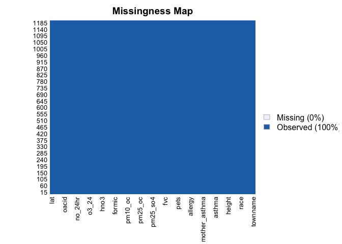

Assignment2
================
yutian
10/032022

Load libraries

``` r
library(dplyr)
library(tidyverse)
library(data.table)
library(skimr)
library(tidyr)
```

For this assignment, we will be analyzing data from USC’s Children’s
Health Study. The learning objectives are to conduct data wrangling and
visualize the data with key questions in mind.

# **Data Wrangling**

You will need to download two datasets from
<https://github.com/USCbiostats/data-science-data>. The individual and
regional CHS datasets in 01_chs. The individual data includes personal
and health characteristics of children in 12 communities across Southern
California. The regional data include air quality measurements at the
community level. Once downloaded, you can merge these datasets using the
location variable.

# 1. Read in the data

I have already downloaded the data sets from github, so I just read it
from my local directory

``` r
ind <- read_csv("../data-science-data/01_chs/chs_individual.csv")
```

    ## Rows: 1200 Columns: 23
    ## ── Column specification ────────────────────────────────────────────────────────
    ## Delimiter: ","
    ## chr  (2): townname, race
    ## dbl (21): sid, male, hispanic, agepft, height, weight, bmi, asthma, active_a...
    ## 
    ## ℹ Use `spec()` to retrieve the full column specification for this data.
    ## ℹ Specify the column types or set `show_col_types = FALSE` to quiet this message.

``` r
reg <- read_csv("../data-science-data/01_chs/chs_regional.csv")
```

    ## Rows: 12 Columns: 27
    ## ── Column specification ────────────────────────────────────────────────────────
    ## Delimiter: ","
    ## chr  (1): townname
    ## dbl (26): pm25_mass, pm25_so4, pm25_no3, pm25_nh4, pm25_oc, pm25_ec, pm25_om...
    ## 
    ## ℹ Use `spec()` to retrieve the full column specification for this data.
    ## ℹ Specify the column types or set `show_col_types = FALSE` to quiet this message.

### Merge the data

Since they have mutual column “townname”, so merge them by it.

``` r
mer <- merge(ind,reg,by="townname")
```

### Check for rownumers to make sure there is not any duplicates

``` r
nrow(ind) == nrow(mer)
```

    ## [1] TRUE

After merging, there is no extra observations meaning there is not any
duplicates

# 2. Data Imputer

### Load Library

``` r
library(mice)
library(missForest)
library(Amelia)
```

### Visualize the missing values

``` r
missmap(mer)
```

<!-- -->

There are only 3% missing values, so I am going to impute some data.

## Impute Data & Save it for use next time

This command
`imputed_data <- mice(mer,m=3,maxit = 20,method = 'pmm',seed = 123)`
will take some time to run, so after I ran it the first time, I saved it
as `imputed_data.rds` which could be read later by `readRDS`

-   m = 3, which means to generate 3 filled data
-   maxit = 20, the number of iterations to generate filling data each
    time, here is 20 times
-   method = ‘pmm’, the continuous data described above adopts the
    method of Predictive Mean Matching

``` r
## Impute missing values 

#imputed_data <- mice(mer,m=3,maxit = 20,method = 'pmm',seed = 123) 

## Save the imputed data
#saveRDS(imputed_data,"imputed_data.rds")

## Read the saved imputed data for use 
imputed_data <- readRDS("imputed_data.rds")
```

``` r
# get complete data ( Select 2nd out of 3 filled data)
completeData.2 <- mice::complete(imputed_data,2)
```

``` r
sum(is.na(completeData.2))
```

    ## [1] 0

After imputing data, there is no missing value

``` r
missmap(completeData.2)
```

<!-- -->

``` r
## Save completed data with imputed data 

#write.csv(completeData.2,"completeData.csv",row.names = FALSE,)

## Read completed data with imputed data 
completeData.2 <- read.csv("completeData.csv")
```

``` r
summary(completeData.2$bmi)
```

    ##    Min. 1st Qu.  Median    Mean 3rd Qu.    Max. 
    ##   11.30   15.39   17.19   18.07   19.99   41.27

``` r
summary(completeData.2$fev)
```

    ##    Min. 1st Qu.  Median    Mean 3rd Qu.    Max. 
    ##   984.8  1749.0  1991.2  1973.5  2223.6  3323.7

``` r
summary(completeData.2$smoke)
```

    ##    Min. 1st Qu.  Median    Mean 3rd Qu.    Max. 
    ##  0.0000  0.0000  0.0000  0.1583  0.0000  1.0000

``` r
summary(completeData.2$gasstove)
```

    ##    Min. 1st Qu.  Median    Mean 3rd Qu.    Max. 
    ##  0.0000  1.0000  1.0000  0.7875  1.0000  1.0000

There is not any missing value or implausible value, so we can use this
data set for futher analysis.

# 3. Create a new categorical variable named ‘obseity_level’

Create a new categorical variable named “obesity_level” using the BMI
measurement (underweight BMI\<14; normal BMI 14-22; overweight BMI
22-24; obese BMI>24).

``` r
comptable <- as.data.table(completeData.2)
comptable[, obesity_level := fifelse(bmi<14,"underweight",fifelse(bmi>=14 & bmi<22,"normal",fifelse(bmi>=22 & bmi <=24,"overweight","obese")))]
```

To make sure the variable is rightly coded, create a summary table that
contains the minimum BMI, maximum BMI, and the total number of
observations per category.

``` r
comptable %>%
  group_by(obesity_level) %>%
  summarise_at(c("bmi"),
  list(count=~n(),min=~min(.),max = ~max(.))) %>%
  knitr::kable()
```

| obesity_level | count |      min |      max |
|:--------------|------:|---------:|---------:|
| normal        |   886 | 14.00380 | 21.96387 |
| obese         |   103 | 24.00647 | 41.26613 |
| overweight    |    87 | 22.02353 | 23.99650 |
| underweight   |   124 | 11.29640 | 13.98601 |

Here is a summary data table including the maximum value, minimum value
and the count number in four different obesity_level categories

# 4. Create another categorical variable named “smoke_gas_exposure”

It should summarizes “Second Hand Smoke” and “Gas Stove.” The variable
should have four categories in total.

``` r
# look into the output
unique(comptable$smoke)
```

    ## [1] 0 1

``` r
unique(comptable$gasstove)
```

    ## [1] 0 1

Both `smoke` and `gasstove` are binary which means there are 4 kinds of
combinations, so name each category as following.

``` r
# create a new category
comptable[, smoke_gas_exposure :=fifelse(smoke == 1 &gasstove ==1 ,"both",fifelse(smoke == 1 &gasstove == 0 ,"smoke_only",fifelse(smoke == 0 &gasstove ==1,"gas_only","neither")))]
```

# 5. Create four summary tables

showing the average (or proportion, if binary) and sd of “Forced
expiratory volume in 1 second (ml)” and asthma indicator by town, sex,
obesity level, and “smoke_gas_exposure.”

## Summary by different levels

### by townname

``` r
comptable %>%
  group_by(townname) %>%
  summarise(
    count=n(), 
    mean.fev = mean(fev,na.rm= TRUE),
            sd.fev = sd(fev,na.rm = TRUE))%>%
    knitr::kable()
```

| townname      | count | mean.fev |   sd.fev |
|:--------------|------:|---------:|---------:|
| Alpine        |   100 | 2057.524 | 332.2646 |
| Atascadero    |   100 | 2054.527 | 351.9800 |
| Lake Elsinore |   100 | 1982.213 | 370.9430 |
| Lake Gregory  |   100 | 1987.482 | 438.6853 |
| Lancaster     |   100 | 1921.929 | 402.0930 |
| Lompoc        |   100 | 1977.068 | 412.0664 |
| Long Beach    |   100 | 1931.975 | 380.3237 |
| Mira Loma     |   100 | 1940.451 | 372.0752 |
| Riverside     |   100 | 1922.079 | 356.3344 |
| San Dimas     |   100 | 2018.290 | 330.7229 |
| Santa Maria   |   100 | 1932.066 | 413.5523 |
| Upland        |   100 | 1955.987 | 422.6039 |

#### Conclusion

There are 100 observations each town. Town Alpine has the largest `fev`
mean value and `fev` in Lake Elsinore varies the most.

### by sex

Count the proportion of `male` and `female`

``` r
comptable %>%
  group_by(male) %>%
  summarise(
    count=n(), 
    mean.fev = mean(fev,na.rm= TRUE),
            sd.fev = sd(fev,na.rm = TRUE)) %>%
  mutate(proportion = count / sum(count))%>%
    knitr::kable()
```

| male | count | mean.fev |   sd.fev | proportion |
|-----:|------:|---------:|---------:|-----------:|
|    0 |   610 | 1896.686 | 381.1980 |  0.5083333 |
|    1 |   590 | 2052.848 | 372.0247 |  0.4916667 |

#### Conclusion

Here the Sex level is binary.

The proportion of sex in this data is about half-half and the mean `fev`
value among male is larger than it among female, `fev` values among
female varies more.

### by obesity level

``` r
comptable %>%
  group_by(obesity_level) %>%
  summarise(
    count=n(), 
    mean.fev = mean(fev,na.rm= TRUE),
    sd.fev = sd(fev,na.rm = TRUE))%>%
    knitr::kable()
```

| obesity_level | count | mean.fev |   sd.fev |
|:--------------|------:|---------:|---------:|
| normal        |   886 | 1994.583 | 312.9810 |
| obese         |   103 | 2263.517 | 329.1712 |
| overweight    |    87 | 2224.322 | 317.4261 |
| underweight   |   124 | 1405.649 | 365.1886 |

#### Conclusion

-   Most observations are belong to `normal` obesity_level.
-   The Mean value of `fev` is larger among people with larger `bmi`.

### by smoke_gas_expore

``` r
comptable %>%
  group_by(smoke_gas_exposure) %>%
  summarise(
    count=n(), 
    mean.fev = mean(fev,na.rm= TRUE),
    sd.fev = sd(fev,na.rm = TRUE)) %>%
    mutate(proportion = count / sum(count))%>%
    knitr::kable()
```

| smoke_gas_exposure | count | mean.fev |   sd.fev | proportion |
|:-------------------|------:|---------:|---------:|-----------:|
| both               |   154 | 1940.784 | 399.3278 |  0.1283333 |
| gas_only           |   791 | 1973.660 | 375.3742 |  0.6591667 |
| neither            |   219 | 2014.940 | 381.6821 |  0.1825000 |
| smoke_only         |    36 | 1856.699 | 502.1093 |  0.0300000 |

#### Conclusion

Only 3% of the samples only smoke without exposing to gas, and the mean
`fev`value is the smallest among people either smoke nor are exposed to
gas

# **EDA**

The primary questions of interest are:  
1. What is the association between BMI and FEV (forced expiratory
volume)?  
2. What is the association between smoke and gas exposure and FEV?  
3. What is the association between PM2.5 exposure and FEV?  

Follow the EDA checklist from week 3 and the previous assignment. Be
sure to focus on the key variables. Visualization Create the following
figures and interpret them. Be sure to include easily understandable
axes, titles, and legends.  

### (1). Check the dimensions, headers, footers. How many columns, rows are there?

``` r
dim(comptable)
```

    ## [1] 1200   51

``` r
head(comptable)
```

    ##    townname sid male race hispanic    agepft height weight      bmi asthma
    ## 1:   Alpine 841    1    W        1 10.548939    150     78 15.75758      0
    ## 2:   Alpine 835    0    W        0 10.099932    143     69 15.33749      0
    ## 3:   Alpine 838    0    O        1  9.486653    133     62 15.93183      0
    ## 4:   Alpine 840    0    W        0  9.965777    146     78 16.63283      0
    ## 5:   Alpine 865    0    W        0 10.039699    162    140 24.24797      1
    ## 6:   Alpine 867    0    W        1  9.957563    141     94 21.49151      0
    ##    active_asthma father_asthma mother_asthma wheeze hayfever allergy
    ## 1:             0             0             0      0        0       0
    ## 2:             0             0             0      0        0       1
    ## 3:             0             0             0      0        0       0
    ## 4:             0             0             0      0        0       0
    ## 5:             1             0             0      1        0       1
    ## 6:             0             0             0      0        0       0
    ##    educ_parent smoke pets gasstove      fev      fvc     mmef pm25_mass
    ## 1:           5     0    1        0 2251.505 2594.649 2445.151      8.74
    ## 2:           3     0    1        0 2529.276 2826.316 3406.579      8.74
    ## 3:           4     0    1        0 1737.793 1963.545 2133.110      8.74
    ## 4:           3     0    0        1 2466.791 2638.221 3466.464      8.74
    ## 5:           3     0    1        1 2583.934 3567.541 2071.475      8.74
    ## 6:           5     0    1        1 1973.115 2154.098 2690.164      8.74
    ##    pm25_so4 pm25_no3 pm25_nh4 pm25_oc pm25_ec pm25_om pm10_oc pm10_ec pm10_tc
    ## 1:     1.73     1.59     0.88    2.54    0.48    3.04    3.25    0.49    3.75
    ## 2:     1.73     1.59     0.88    2.54    0.48    3.04    3.25    0.49    3.75
    ## 3:     1.73     1.59     0.88    2.54    0.48    3.04    3.25    0.49    3.75
    ## 4:     1.73     1.59     0.88    2.54    0.48    3.04    3.25    0.49    3.75
    ## 5:     1.73     1.59     0.88    2.54    0.48    3.04    3.25    0.49    3.75
    ## 6:     1.73     1.59     0.88    2.54    0.48    3.04    3.25    0.49    3.75
    ##    formic acetic  hcl hno3 o3_max o3106 o3_24   no2  pm10 no_24hr pm2_5_fr
    ## 1:   1.03   2.49 0.41 1.98  65.82 55.05 41.23 12.18 24.73    2.48    10.28
    ## 2:   1.03   2.49 0.41 1.98  65.82 55.05 41.23 12.18 24.73    2.48    10.28
    ## 3:   1.03   2.49 0.41 1.98  65.82 55.05 41.23 12.18 24.73    2.48    10.28
    ## 4:   1.03   2.49 0.41 1.98  65.82 55.05 41.23 12.18 24.73    2.48    10.28
    ## 5:   1.03   2.49 0.41 1.98  65.82 55.05 41.23 12.18 24.73    2.48    10.28
    ## 6:   1.03   2.49 0.41 1.98  65.82 55.05 41.23 12.18 24.73    2.48    10.28
    ##    iacid oacid total_acids       lon      lat obesity_level smoke_gas_exposure
    ## 1:  2.39  3.52         5.5 -116.7664 32.83505        normal            neither
    ## 2:  2.39  3.52         5.5 -116.7664 32.83505        normal            neither
    ## 3:  2.39  3.52         5.5 -116.7664 32.83505        normal            neither
    ## 4:  2.39  3.52         5.5 -116.7664 32.83505        normal           gas_only
    ## 5:  2.39  3.52         5.5 -116.7664 32.83505         obese           gas_only
    ## 6:  2.39  3.52         5.5 -116.7664 32.83505        normal           gas_only

``` r
tail(comptable)
```

    ##    townname  sid male race hispanic    agepft height weight      bmi asthma
    ## 1:   Upland 1866    0    O        1  9.806982    139     60 14.11559      0
    ## 2:   Upland 1867    0    M        1  9.618070    140     71 16.46568      0
    ## 3:   Upland 2033    0    M        0 10.121834    130     67 18.02044      0
    ## 4:   Upland 2031    1    W        0  9.798768    135     83 20.70084      0
    ## 5:   Upland 2032    1    W        0  9.549624    137     59 14.28855      0
    ## 6:   Upland 2053    0    W        0 10.376454    154     63 12.59330      0
    ##    active_asthma father_asthma mother_asthma wheeze hayfever allergy
    ## 1:             0             0             0      0        0       0
    ## 2:             0             1             0      0        0       0
    ## 3:             1             0             0      1        1       0
    ## 4:             0             0             0      1        0       1
    ## 5:             0             0             1      1        1       1
    ## 6:             0             0             0      0        0       0
    ##    educ_parent smoke pets gasstove      fev      fvc     mmef pm25_mass
    ## 1:           3     0    1        0 1691.275 1928.859 1890.604     22.46
    ## 2:           3     0    1        0 1733.338 1993.040 2072.643     22.46
    ## 3:           3     0    1        1 1929.866 2122.148 2558.054     22.46
    ## 4:           3     0    1        1 2034.177 2505.535 1814.075     22.46
    ## 5:           3     0    1        1 2077.703 2275.338 2706.081     22.46
    ## 6:           3     0    1        0 1146.449 1781.000 3802.020     22.46
    ##    pm25_so4 pm25_no3 pm25_nh4 pm25_oc pm25_ec pm25_om pm10_oc pm10_ec pm10_tc
    ## 1:     2.65     7.75     2.96    6.49    1.19    7.79    8.32    1.22    9.54
    ## 2:     2.65     7.75     2.96    6.49    1.19    7.79    8.32    1.22    9.54
    ## 3:     2.65     7.75     2.96    6.49    1.19    7.79    8.32    1.22    9.54
    ## 4:     2.65     7.75     2.96    6.49    1.19    7.79    8.32    1.22    9.54
    ## 5:     2.65     7.75     2.96    6.49    1.19    7.79    8.32    1.22    9.54
    ## 6:     2.65     7.75     2.96    6.49    1.19    7.79    8.32    1.22    9.54
    ##    formic acetic  hcl hno3 o3_max o3106 o3_24   no2 pm10 no_24hr pm2_5_fr iacid
    ## 1:   2.67   4.73 0.46 4.03  63.83  46.5  22.2 37.97 40.8   18.48    27.73  4.49
    ## 2:   2.67   4.73 0.46 4.03  63.83  46.5  22.2 37.97 40.8   18.48    27.73  4.49
    ## 3:   2.67   4.73 0.46 4.03  63.83  46.5  22.2 37.97 40.8   18.48    27.73  4.49
    ## 4:   2.67   4.73 0.46 4.03  63.83  46.5  22.2 37.97 40.8   18.48    27.73  4.49
    ## 5:   2.67   4.73 0.46 4.03  63.83  46.5  22.2 37.97 40.8   18.48    27.73  4.49
    ## 6:   2.67   4.73 0.46 4.03  63.83  46.5  22.2 37.97 40.8   18.48    27.73  4.49
    ##    oacid total_acids       lon      lat obesity_level smoke_gas_exposure
    ## 1:   7.4       11.43 -117.6484 34.09751        normal            neither
    ## 2:   7.4       11.43 -117.6484 34.09751        normal            neither
    ## 3:   7.4       11.43 -117.6484 34.09751        normal           gas_only
    ## 4:   7.4       11.43 -117.6484 34.09751        normal           gas_only
    ## 5:   7.4       11.43 -117.6484 34.09751        normal           gas_only
    ## 6:   7.4       11.43 -117.6484 34.09751   underweight            neither

The dimension remained 1200 \* (27+23-1+2),which is correct. The header
and footer of this data set have been checked.

### (2). Take a look at the variables

``` r
str(comptable)
```

    ## Classes 'data.table' and 'data.frame':   1200 obs. of  51 variables:
    ##  $ townname          : chr  "Alpine" "Alpine" "Alpine" "Alpine" ...
    ##  $ sid               : int  841 835 838 840 865 867 842 839 844 847 ...
    ##  $ male              : int  1 0 0 0 0 0 1 0 1 1 ...
    ##  $ race              : chr  "W" "W" "O" "W" ...
    ##  $ hispanic          : int  1 0 1 0 0 1 1 1 1 0 ...
    ##  $ agepft            : num  10.55 10.1 9.49 9.97 10.04 ...
    ##  $ height            : int  150 143 133 146 162 141 139 142 143 137 ...
    ##  $ weight            : int  78 69 62 78 140 94 65 86 65 69 ...
    ##  $ bmi               : num  15.8 15.3 15.9 16.6 24.2 ...
    ##  $ asthma            : int  0 0 0 0 1 0 0 0 1 0 ...
    ##  $ active_asthma     : int  0 0 0 0 1 0 0 0 0 0 ...
    ##  $ father_asthma     : int  0 0 0 0 0 0 0 0 0 0 ...
    ##  $ mother_asthma     : int  0 0 0 0 0 0 0 1 0 0 ...
    ##  $ wheeze            : int  0 0 0 0 1 0 1 1 1 0 ...
    ##  $ hayfever          : int  0 0 0 0 0 0 0 1 0 0 ...
    ##  $ allergy           : int  0 1 0 0 1 0 0 1 0 0 ...
    ##  $ educ_parent       : int  5 3 4 3 3 5 1 3 3 5 ...
    ##  $ smoke             : int  0 0 0 0 0 0 1 1 0 0 ...
    ##  $ pets              : int  1 1 1 0 1 1 1 1 0 1 ...
    ##  $ gasstove          : int  0 0 0 1 1 1 0 0 1 1 ...
    ##  $ fev               : num  2252 2529 1738 2467 2584 ...
    ##  $ fvc               : num  2595 2826 1964 2638 3568 ...
    ##  $ mmef              : num  2445 3407 2133 3466 2071 ...
    ##  $ pm25_mass         : num  8.74 8.74 8.74 8.74 8.74 8.74 8.74 8.74 8.74 8.74 ...
    ##  $ pm25_so4          : num  1.73 1.73 1.73 1.73 1.73 1.73 1.73 1.73 1.73 1.73 ...
    ##  $ pm25_no3          : num  1.59 1.59 1.59 1.59 1.59 1.59 1.59 1.59 1.59 1.59 ...
    ##  $ pm25_nh4          : num  0.88 0.88 0.88 0.88 0.88 0.88 0.88 0.88 0.88 0.88 ...
    ##  $ pm25_oc           : num  2.54 2.54 2.54 2.54 2.54 2.54 2.54 2.54 2.54 2.54 ...
    ##  $ pm25_ec           : num  0.48 0.48 0.48 0.48 0.48 0.48 0.48 0.48 0.48 0.48 ...
    ##  $ pm25_om           : num  3.04 3.04 3.04 3.04 3.04 3.04 3.04 3.04 3.04 3.04 ...
    ##  $ pm10_oc           : num  3.25 3.25 3.25 3.25 3.25 3.25 3.25 3.25 3.25 3.25 ...
    ##  $ pm10_ec           : num  0.49 0.49 0.49 0.49 0.49 0.49 0.49 0.49 0.49 0.49 ...
    ##  $ pm10_tc           : num  3.75 3.75 3.75 3.75 3.75 3.75 3.75 3.75 3.75 3.75 ...
    ##  $ formic            : num  1.03 1.03 1.03 1.03 1.03 1.03 1.03 1.03 1.03 1.03 ...
    ##  $ acetic            : num  2.49 2.49 2.49 2.49 2.49 2.49 2.49 2.49 2.49 2.49 ...
    ##  $ hcl               : num  0.41 0.41 0.41 0.41 0.41 0.41 0.41 0.41 0.41 0.41 ...
    ##  $ hno3              : num  1.98 1.98 1.98 1.98 1.98 1.98 1.98 1.98 1.98 1.98 ...
    ##  $ o3_max            : num  65.8 65.8 65.8 65.8 65.8 ...
    ##  $ o3106             : num  55 55 55 55 55 ...
    ##  $ o3_24             : num  41.2 41.2 41.2 41.2 41.2 ...
    ##  $ no2               : num  12.2 12.2 12.2 12.2 12.2 ...
    ##  $ pm10              : num  24.7 24.7 24.7 24.7 24.7 ...
    ##  $ no_24hr           : num  2.48 2.48 2.48 2.48 2.48 2.48 2.48 2.48 2.48 2.48 ...
    ##  $ pm2_5_fr          : num  10.3 10.3 10.3 10.3 10.3 ...
    ##  $ iacid             : num  2.39 2.39 2.39 2.39 2.39 2.39 2.39 2.39 2.39 2.39 ...
    ##  $ oacid             : num  3.52 3.52 3.52 3.52 3.52 3.52 3.52 3.52 3.52 3.52 ...
    ##  $ total_acids       : num  5.5 5.5 5.5 5.5 5.5 5.5 5.5 5.5 5.5 5.5 ...
    ##  $ lon               : num  -117 -117 -117 -117 -117 ...
    ##  $ lat               : num  32.8 32.8 32.8 32.8 32.8 ...
    ##  $ obesity_level     : chr  "normal" "normal" "normal" "normal" ...
    ##  $ smoke_gas_exposure: chr  "neither" "neither" "neither" "gas_only" ...
    ##  - attr(*, ".internal.selfref")=<externalptr>

All variables are stored in correct data type.

### (3).Take a closer look at the key variables.

``` r
summary(comptable$bmi)
```

    ##    Min. 1st Qu.  Median    Mean 3rd Qu.    Max. 
    ##   11.30   15.39   17.19   18.07   19.99   41.27

``` r
summary(comptable$fev)
```

    ##    Min. 1st Qu.  Median    Mean 3rd Qu.    Max. 
    ##   984.8  1749.0  1991.2  1973.5  2223.6  3323.7

``` r
summary(comptable$smoke)
```

    ##    Min. 1st Qu.  Median    Mean 3rd Qu.    Max. 
    ##  0.0000  0.0000  0.0000  0.1583  0.0000  1.0000

``` r
summary(comptable$gasstove)
```

    ##    Min. 1st Qu.  Median    Mean 3rd Qu.    Max. 
    ##  0.0000  1.0000  1.0000  0.7875  1.0000  1.0000

``` r
summary(comptable$pm25_mass)
```

    ##    Min. 1st Qu.  Median    Mean 3rd Qu.    Max. 
    ##   5.960   7.615  10.545  14.362  20.988  29.970

There is not any implausible value or missing value .

# Visualization

visualization

``` r
library(ggpubr)
library(ggplot2)
library(leaflet)
```

## 1. Facet plot showing scatterplots with regression lines of BMI vs FEV by “townname”.

``` r
comptable %>% 
  ggplot(aes(bmi, fev)) + 
  geom_point(aes(color = townname)) + 
  geom_smooth(method = lm,formula = y~x,
              aes(color = townname), 
              se = FALSE,)+stat_cor(method = "pearson", label.x = 10, label.y = 600,size=3)+facet_wrap(~townname) + ggtitle("fev_vs_bmi in different towns")
```

<!-- -->
#### Conclusion

From these figures, it can be seen that `fev` and `bmi` seems like
positively correlated which means `fev` values is increasing with the
increasing `bmi`.

Use pearson method to calculate the correlation coefficient (R) and P
value

**correlation coefficient (R)**

-   0.8-1.0 very strong correlation
-   0.6-0.8 Strong correlation
-   0.4-0.6 Moderately correlated
-   0.2-0.4 Weak correlation
-   0.0-0.2 Very weak or no correlation

**P vlaue **

Generally if the p value is less than 0.05, we consider it as
significant.P value is very important because if it is not significant,
the correlation coefficient is useless no matter how high it is since it
may only be caused by accidental factors.

The p value in each town is less than 0.05, so it may be safe to say it
is very likely `fev` and `bmi` are positively correlated.

## 2. Stacked histograms of FEV by BMI category and FEV by smoke/gas exposure. Use different color schemes than the ggplot default.

``` r
ggplot(comptable, aes(x=fev, fill=obesity_level)) +
  geom_histogram(color="red",bins=20)+ scale_fill_manual(values = c("lightblue",
    "purple", "green", "yellow"))+ggtitle("Stacked histograms of FEV by BMI category")
```

<!-- -->
#### Conclusion

This figure shows that most observations are belong to Normal
`obesity_level`. It looks like it is normal distributed, so use
**Shapiro-Wilk normality test** to check the normality of the data.

``` r
shapiro.test(subset(comptable, obesity_level == "normal")$fev)
```

    ## 
    ##  Shapiro-Wilk normality test
    ## 
    ## data:  subset(comptable, obesity_level == "normal")$fev
    ## W = 0.99416, p-value = 0.001631

The null hypothesis for Shapiro-Wilk test is that your data is normal.
Since the p value is less than 0.05, then you reject the null hypothesis
at 5% significance and conclude that your data is non-normal.

This figure also shows that `fev` value of most underweight people is
smaller than overweight and obese people in this data set.

``` r
ggplot(comptable, aes(x=fev, fill=smoke_gas_exposure)) +
  geom_histogram(color="red",bins=20)+scale_fill_manual(values = c("lightpink",
    "grey", "lightgreen", "lightyellow"))+ggtitle("Stacked histograms of FEV by smoke_gas_exposure")
```

<!-- -->
#### Conclusion

This plot shows that most observations are exposed to gas and smoke or
only exposed to smoke, very few of them only smoke without exposed to
gas.

## 3. Barchart of BMI by smoke/gas exposure

``` r
ggplot(comptable) + 
  geom_bar(mapping = aes(x = obesity_level, fill = smoke_gas_exposure))+scale_fill_viridis_d()+ggtitle("Barchart of BMI by smoke/gas exposure")
```

<!-- -->
#### Conclusion

From this figure, it is clear that the proportion of different
categories of `smoke_gas_exposure` is very similar among all
`obesity_level`. The proportion of people who do not smoke and are only
exposed to gas is higher in all obesity_level categories, and the
proportion of people who only smoke is the lowest in all obesity_levels.

## 4. Statistical summary graphs of FEV by BMI and FEV by smoke/gas exposure category.

``` r
comptable %>%
  ggplot()+
  stat_summary(mapping = aes(x=reorder(obesity_level,fev,FUN=median),y=fev,color = obesity_level), fun.min = min,
    fun.max = max,
    fun = median) + ggtitle("stastical summary plot  fev vs bmi")
```

<!-- -->
#### Conclusion

The median `fev` value is increasing with the increasing `bmi`.

``` r
comptable %>%
  ggplot()+
  stat_summary(mapping = aes(x=smoke_gas_exposure,y=fev,color = smoke_gas_exposure,), fun.min = min,
    fun.max = max,
    fun = median)+ ggtitle("stastical summary fev vs smoke/gas_exposure")
```

<!-- -->

#### Conclusion

The median `fev` value is about 2000 for each `smoke_gas_exposure`
group.

## 5. A leaflet map showing the concentrations of PM2.5 mass in each of the CHS communities.

``` r
pal <- colorFactor(
  palette = 'plasma',
  domain = reg$townname
)
leaflet(reg) %>% 
  addProviderTiles('CartoDB.Positron') %>% 
  addCircles(lat = reg$lat, lng = reg$lon, opacity = 1, fillOpacity = 1, radius = 40,color = ~pal(townname)) %>%
  addLegend("topright", pal = colorFactor(
    palette = "plasma", reg$pm25_mass),values = reg$pm25_mass,opacity = 1)
```

<!-- -->

#### Conclusion

This map shows that ciry with a higher concentration of `pm25_mass`is
mainly located in urban areas with developed traffic routes. The
`pm25_mass` values are lower in cities far away from Los Angeles.

## 6. Choose a visualization to examine whether PM2.5 mass is associated with FEV.

``` r
comptable %>%
  ggplot(mapping = aes(pm25_mass, fev, alpha = 0.5)) + 
  geom_point(mapping = aes(color = townname)) + geom_smooth(
method = lm, formula = y ~ x)+stat_cor(method = "pearson", label.x = 3, label.y = 30)+ ggtitle("Visualization of pm25_mass vs fev")
```

<!-- -->
#### Conclusion

This figure shows that although there is a slight decrease of `fev` with
the increasing `pm25_mass`, the p value is greater than 0.05, so the
correlation coefficient is not statistically significant.
