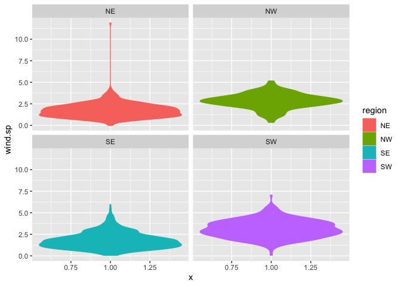
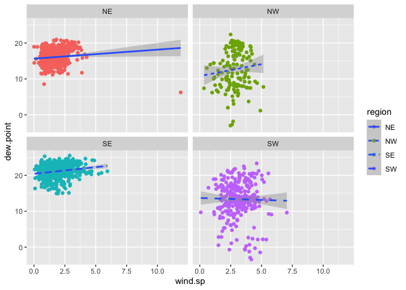
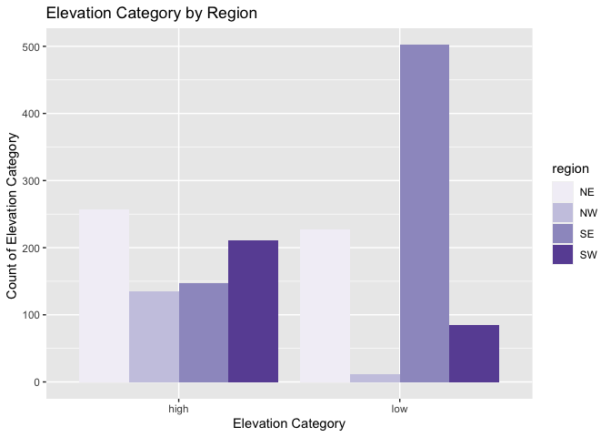
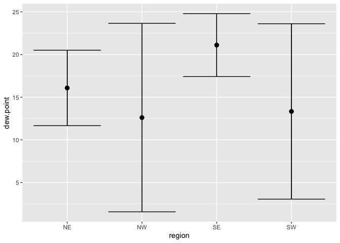
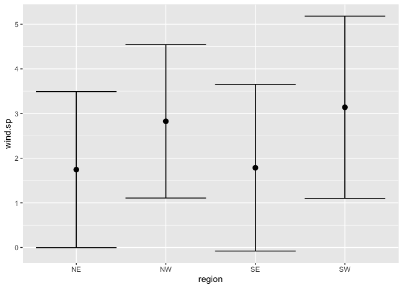
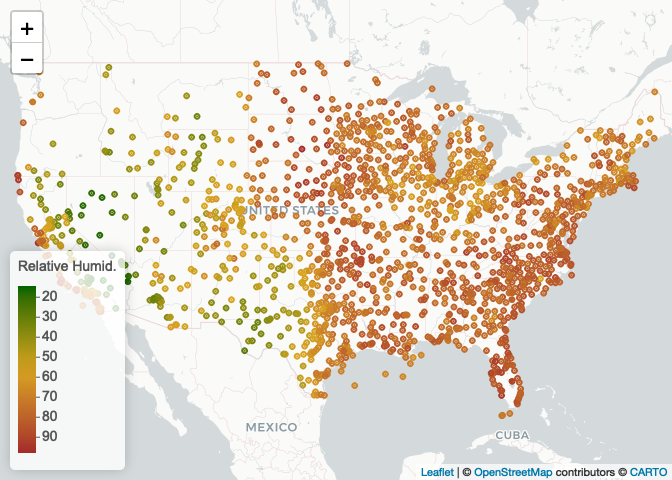
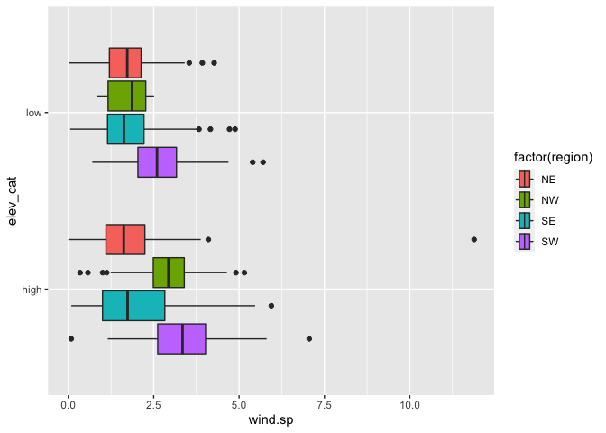

lab 04
================
yutian
9/7/2022

``` r
library(lubridate)
```

    ## 
    ## Attaching package: 'lubridate'

    ## The following objects are masked from 'package:base':
    ## 
    ##     date, intersect, setdiff, union

``` r
library(tidyverse)
```

    ## ── Attaching packages ─────────────────────────────────────── tidyverse 1.3.1 ──

    ## ✔ ggplot2 3.3.5     ✔ purrr   0.3.4
    ## ✔ tibble  3.1.6     ✔ dplyr   1.0.8
    ## ✔ tidyr   1.2.0     ✔ stringr 1.4.0
    ## ✔ readr   2.1.2     ✔ forcats 0.5.1

    ## ── Conflicts ────────────────────────────────────────── tidyverse_conflicts() ──
    ## ✖ lubridate::as.difftime() masks base::as.difftime()
    ## ✖ lubridate::date()        masks base::date()
    ## ✖ dplyr::filter()          masks stats::filter()
    ## ✖ lubridate::intersect()   masks base::intersect()
    ## ✖ dplyr::lag()             masks stats::lag()
    ## ✖ lubridate::setdiff()     masks base::setdiff()
    ## ✖ lubridate::union()       masks base::union()

``` r
library(data.table)
```

    ## 
    ## Attaching package: 'data.table'

    ## The following objects are masked from 'package:dplyr':
    ## 
    ##     between, first, last

    ## The following object is masked from 'package:purrr':
    ## 
    ##     transpose

    ## The following objects are masked from 'package:lubridate':
    ## 
    ##     hour, isoweek, mday, minute, month, quarter, second, wday, week,
    ##     yday, year

## Step1. Read in the data

First download and then read in with data.table:fread()

``` r
if(!file.exists('../lab03/met_all.gz'))
download.file("https://raw.githubusercontent.com/USCbiostats/data-science-data/master/02_met/met_all.gz", "met_all.gz", method="libcurl", timeout = 60)
met <- data.table::fread("../lab03/met_all.gz")
```

## Step2. Prep Data

Remove temperatures less than -17C and change elev 9999 to missing value
code.

``` r
met <- met[temp > -17][elev == 9999.0, elev := NA]
```

Generate a date variable using the functions as.Date() (hint: You will
need the following to create a date paste(year, month, day, sep = “-”)).

``` r
met <- met[ ,  ymd := as.Date(paste(year, month, day, sep = "-"))]
```

Using the data.table::week function, keep the observations of the first
week of the month.

``` r
met[, table(week(ymd))]
```

    ## 
    ##     31     32     33     34     35 
    ## 297259 521600 527922 523847 446576

``` r
met <- met[ week(ymd) == 31 ]
```

Compute the mean by station of the variables temp, rh, wind.sp,
vis.dist, dew.point, lat, lon, and elev.

### check no 9999s in other important variables

``` r
met[, .(
  temp      = max(temp,na.rm=T),
  rh        = max(rh,na.rm=T), 
  wind.sp   = max(wind.sp,na.rm=T), 
  vis.dist  = max(vis.dist,na.rm=T), 
  dew.point = max(dew.point,na.rm=T), 
  lat       = max(lat,na.rm=T), 
  lon       = max(lon,na.rm=T), 
  elev      = max(elev,na.rm=T)
)]
```

    ##    temp  rh wind.sp vis.dist dew.point    lat     lon elev
    ## 1:   47 100    20.6   144841        29 48.941 -68.313 4113

There is no 9999s in the dataset

``` r
met_avg <- met[, .(
  temp      = mean(temp,na.rm=T),
  rh        = mean(rh,na.rm=T), 
  wind.sp   = mean(wind.sp,na.rm=T), 
  vis.dist  = mean(vis.dist,na.rm=T), 
  dew.point = mean(dew.point,na.rm=T), 
  lat       = mean(lat,na.rm=T), 
  lon       = mean(lon,na.rm=T), 
  elev      = mean(elev,na.rm=T)
), by = "USAFID"]
```

Create a region variable for NW, SW, NE, SE based on lon = -98.00 and
lat = 39.71 degrees

``` r
met_avg[, region := fifelse(lon >= -98 & lat > 39.71, "NE",
                fifelse(lon < -98 & lat > 39.71, "NW",
                fifelse(lon < -98 & lat <= 39.71, "SW","SE")))
    ]
table(met_avg$region)
```

    ## 
    ##  NE  NW  SE  SW 
    ## 484 146 649 296

Create a categorical variable for elevation as in the lecture slides

``` r
met_avg[,elev_cat := fifelse(elev > 252, "high", "low")]
```

## Step3. Make Violin plots of dew point temp by region

``` r
met_avg[!is.na(region)] %>%
  ggplot()+
  geom_violin(mapping = aes(x=1,y=dew.point,color = region,fill = region))+facet_wrap(~region,nrow = 1)
```

<!-- --> From the
plot, it can be seen that the highest dew point temperatures are
reported in the southeast.

``` r
met_avg[!is.na(region) & !is.na(wind.sp)] %>%
  ggplot()+
  geom_violin(mapping = aes(x=1,y=wind.sp,color = region,fill = region)) +
  facet_wrap(~region, nrow =2)
```

<!-- -->

Winds in the southeast and northeest are concentrated at 0 to 2.5

## Step4. Use geom_point with geom_smooth to examine the association between dew point temperature and wind speed by region

Colour points by region Make sure to deal with NA category Fit a linear
regression line by region Describe what you observe in the graph

``` r
met_avg[!is.na(region) & !is.na(wind.sp)] %>% 
  ggplot(mapping = aes(x = wind.sp, y = dew.point)) + 
  geom_point(mapping = aes(color = region)) + 
  geom_smooth(method = lm, mapping = aes(linetype = region)) +
  facet_wrap(~ region, nrow = 2)
```

    ## `geom_smooth()` using formula 'y ~ x'

<!-- -->
the number of dew.point in NE, NW, SE were going up with the increase of
wind.sp the number of dew.point in SW was going down with the increase
of wind.sp

## Step5.Use geom_bar to create barplots of the weather stations by elevation category coloured by region

``` r
met_avg[!is.na(region) & !is.na(elev_cat)] %>%
  ggplot() +
  geom_bar(mapping = aes(x = elev_cat, fill = region), position = "dodge") +
  labs(x = "Elevation Category" , y = "Count of Elevation Category ", title = "Elevation Category by Region") +
  scale_fill_brewer(palette = "Purples")
```

<!-- -->

``` r
met_avg[!is.na(region) & !is.na(elev_cat)] %>% 
  ggplot() + 
  labs(title = "Elev_Cat",x = "Elevation Category" , y = "Count of Elevation Category ")+
  geom_bar(mapping = aes(x = elev_cat, fill = region,color= region), position = "dodge")+
  scale_fill_brewer(palette = "Reds") +
  facet_wrap(~elev_cat)
```

<!-- -->

About 500 places in northeast region have low elevation Few places in
northwest region have low elevation

## Step6. Use stat_summary to examine mean dew point and wind speed by region with standard deviation error bars

``` r
met_avg[!is.na(dew.point)] %>%
  ggplot(mapping = aes(x=region,y=dew.point))+
  stat_summary(fun.data = mean_sdl,geom = "pointrange")+
  stat_summary(fun.data = mean_sdl,geom = "errorbar")
```

<!-- -->

mean_sdl calculates the mean plus or minus the constant times the
standard deviation

The range of dew.point values in the northwest and southwest direction
have relatively larger standard deviation and lower mean than others.

``` r
met_avg[!is.na(wind.sp)] %>%
  ggplot(mapping = aes(x=region,y=wind.sp))+
  stat_summary(fun.data = mean_sdl,geom = "pointrange")+
  stat_summary(fun.data = mean_sdl,geom = "errorbar")
```

<!-- --> ##Step7.
Generate a map of weather stations and show trend in relative humidity
of top 10

``` r
library(leaflet)
# Generating a color palette
rh.pal <- colorNumeric(c('darkgreen','goldenrod','brown'), domain=met_avg$rh)
rh.pal
```

    ## function (x) 
    ## {
    ##     if (length(x) == 0 || all(is.na(x))) {
    ##         return(pf(x))
    ##     }
    ##     if (is.null(rng)) 
    ##         rng <- range(x, na.rm = TRUE)
    ##     rescaled <- scales::rescale(x, from = rng)
    ##     if (any(rescaled < 0 | rescaled > 1, na.rm = TRUE)) 
    ##         warning("Some values were outside the color scale and will be treated as NA")
    ##     if (reverse) {
    ##         rescaled <- 1 - rescaled
    ##     }
    ##     pf(rescaled)
    ## }
    ## <bytecode: 0x7fee8f39bf58>
    ## <environment: 0x7fee8f39df58>
    ## attr(,"colorType")
    ## [1] "numeric"
    ## attr(,"colorArgs")
    ## attr(,"colorArgs")$na.color
    ## [1] "#808080"

``` r
#Use addMarkers to include the top 10 places in relative h (hint: this will be useful rank(-rh) <= 10)
top10rh <- met_avg[ rank(-rh) <= 10]
```

Here I can use top10rh data subset to show just the weather stations
that registered the top 10 relative humidity values in the 1st week of
August. For now I’ll show all:

``` r
rhmap <- leaflet(met_avg) %>% 
  # The looks of the Map
  addProviderTiles('CartoDB.Positron') %>% 
  # Some circles
  addCircles(
    lat = ~lat, lng=~lon,
                                                  # HERE IS OUR PAL!
    label = ~paste0(rh), color = ~ rh.pal(rh),
    opacity = 1, fillOpacity = 1, radius = 500
    ) %>%
  # And a pretty legend
  addLegend('bottomleft', pal=rh.pal, values=met_avg$rh,
          title='Relative Humid.', opacity=1)
rhmap
```

<!-- -->

Places with the Top10 highest relative humid are mainly located on the
East side

## Step8. 8. Use a ggplot extension

In ggstance, you supply aesthetics in their natural order:

``` r
if (!require("ggstance")) install.packages("ggstance")
```

    ## Loading required package: ggstance

    ## 
    ## Attaching package: 'ggstance'

    ## The following objects are masked from 'package:ggplot2':
    ## 
    ##     geom_errorbarh, GeomErrorbarh

``` r
devtools::install_github("lionel-/ggstance")
```

    ## Skipping install of 'ggstance' from a github remote, the SHA1 (b726f758) has not changed since last install.
    ##   Use `force = TRUE` to force installation

``` r
library("ggstance")
```

``` r
# Horizontal with ggstance
ggplot(met_avg, aes(wind.sp, elev_cat, fill = factor(region))) +
  geom_boxploth()
```

    ## Warning: Removed 15 rows containing non-finite values (stat_boxploth).

<!-- -->
